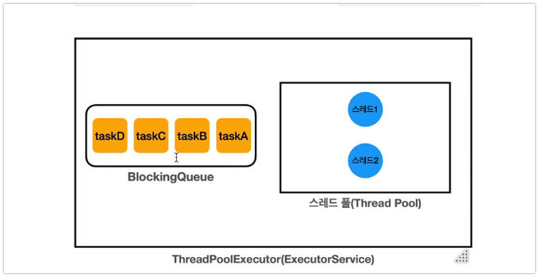

# 1. 실무에서 스레드를 직접 생성하면 안되는 이유

- 실무에서 스레드를 직접 생성해서 사용하면 **3가지 주요 문제가 발생**함
    - **스레드 생성 시간으로 인한 성능 문제**
        - 스레드는 생성 시 자신만의 호출 스택(call stack)을 가져야 하며, 이로 인해 많은 메모리(보통 1MB 이상)가 필요함
        - 스레드 생성은 운영체제 커널 수준에서 처리되어 CPU와 메모리 리소스를 많이 소모함
        - 운영체제 스케줄러가 스레드를 관리하므로 추가적인 오버헤드가 발생함
        - 예시: 작업마다 스레드를 새로 만들면, 작업 실행 시간보다 스레드 생성 시간이 더 오래 걸릴 수 있음
    - **스레드 관리 문제**
        - 서버의 CPU, 메모리 자원은 한정되어 있어 무한정 스레드를 만들 수 없음
        - 갑자기 많은 요청이 몰리면(예: 100개에서 10,000개로 증가) 시스템이 감당하지 못함
        - 안전한 종료, 인터럽트 등 스레드의 상태를 관리하기 어렵고, 실행 중인 스레드를 추적·관리해야 함
    - **Runnable 인터페이스의 불편함**
        - 반환값이 없음: run() 메서드는 결과를 반환하지 않아, 실행 결과를 얻으려면 별도의 변수와 동기화가 필요함
        - 예외 처리의 한계: run()은 체크 예외를 던질 수 없어, 예외 처리를 메서드 내부에서만 해야 함
        - 예시: 스레드가 실행한 결과를 멤버 변수에 저장하고, join() 후에 값을 꺼내야 함


## 2. 스레드 풀과 Executor 프레임워크의 등장 배경

- **스레드 풀(Pool) 개념**
    - 미리 필요한 만큼의 스레드를 만들어 두고, 작업이 오면 대기 중인 스레드를 할당하여 처리함
    - 작업 완료 후 스레드는 종료하지 않고 다시 풀에 반납되어 재사용됨
    - 스레드 풀을 사용하면 스레드 생성 시간을 절약하고, 필요한 만큼만 스레드를 관리할 수 있음
- **Executor 프레임워크의 역할**
    - 스레드 풀, 스레드 관리, Runnable의 불편함을 해결하는 자바 멀티스레드 도구
    - 실무에서는 직접 스레드를 생성하기보다 Executor 프레임워크를 주로 사용함
    - 생산자-소비자 문제도 함께 해결 가능
    - Executor 프레임워크는 멀티스레딩및 병렬 처리를 쉽게 사용할 수 있도록 다양한 기능을 제공함


## 3. Executor 프레임워크의 주요 구성 요소와 기본 사용법


- **생산자 소비자 패턴**
  - `생산자` : execute()로 작업을 호출하면 내부에서 큐에 작업을 보관한다. -> `main 스레드가 생산자가 된다.`
  - `소비자` : 스레드 풀에 있는 스레드가 소비자가 된다. 이후 소비자 중에 하나의 큐에


- **Executor 인터페이스**
    - 가장 단순한 작업 실행 인터페이스로 execute( Runnablecommand) 메서드만 제공
- **ExecutorService 인터페이스**
    - Executor를 확장하여 작업 제출, 제어, 종료 등 다양한 기능 제공
    - 대표 구현체는 ThreadPoolExecutor
    - 주요 메서드: submit(), close(), shutdown() 등
- **ThreadPoolExecutor**
    - 스레드 풀을 관리하는 대표적인 구현체
    - 생성자 주요 파라미터:
        - `corePoolSize`: 기본 스레드 수
        - `maximumPoolSize`: 최대 스레드 수
        - `keepAliveTime`: 초과 스레드의 생존 시간
        - `BlockingQueue`: 작업 대기 큐
    - 예시: `ThreadPoolExecutor(2,2,0, TimeUnit.MILLISECONDS, new LinkedBlockingQueue<>())`
    - - **상태 확인 유틸리티**
  - ThreadPoolExecutor의 상태(풀 내 스레드 수, 활성 스레드 수, 대기 작업 수, 완료 작업 수 등)를 출력하는 printState() 메서드 제공


## 4. Future 

### Runnable의 한계와 Callable/Future의 도입된 배경

- **Runnable의 한계**
    - 반환값이 없고, 예외 처리가 불편함
    - 예시: 별도의 멤버 변수와 join()을 사용해 결과를 받아야 함
- **Callable과 Future의 등장**
    - Callable: 반환값과 체크 예외를 지원하는 인터페이스(call() 메서드)
    - Future: 비동기 작업의 결과를 나중에 받을 수 있는 객체
    - ExecutorService.submit( Callable)을 통해 작업 제출, Future. get()으로 결과 획득

```java
public interface Runnable {
    void run();
}

public interface Callable<V> {
    V call() throws Exception;
}
```