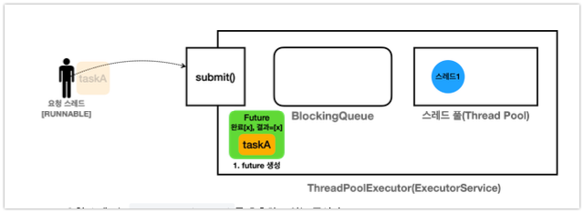
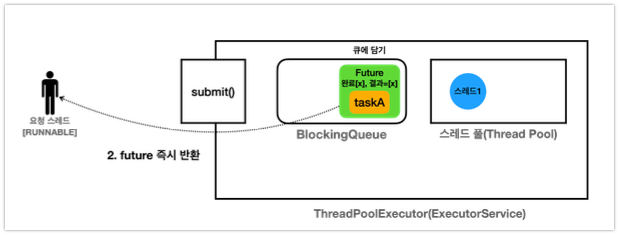
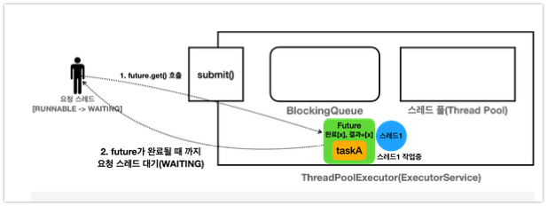
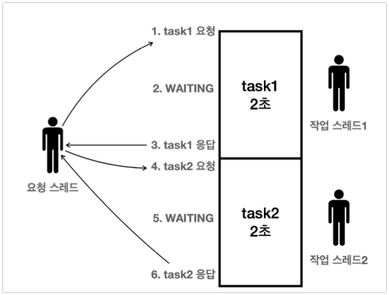

# Future

## 왜 Runnable을 사용하지 않고 Callable/Future 도입

- **Runnable의 한계**
    - 반환값이 없고, 예외 처리가 불편함
    - 예시: 별도의 멤버 변수와 join()을 사용해 결과를 받아야 함
- **Callable과 Future의 등장**
    - Callable: 반환값과 체크 예외를 지원하는 인터페이스(call() 메서드)
    - Future: 비동기 작업의 결과를 나중에 받을 수 있는 객체
    - ExecutorService.submit( Callable)을 통해 작업 제출, Future. get()으로 결과 획득

## Callable/Future의 동작 원리와 활용

- **Future의 동작 원리**
    - submit()호출 시 Future객체가 즉시 반환되고, 작업은 별도의 스레드에서 실행됨
    - Future. get()호출 시 작업이 완료되면 결과를 반환, 미완료 시 블로킹(대기)
    - FutureTask가 실제로 작업의 완료 여부와 결과를 관리함
- **Future의 필요성**
    - Future가 없으면 요청 스레드는 결과를 받을 때까지 대기해야 하므로, 동시에 여러 작업을 처리할 수 없음
    - Future를 사용하면 여러 작업을 동시에 요청하고, 필요할 때 결과를 받을 수 있음

## Future 내부동작



- Future의 경우에는 Runnable과 다르게 `es.submit(task)`을 통해서 호출한다.
- 이때 ExecutorService는 전달한 task(Callable)의 미래 결과를 알 수 있는 Future 객체를 생성한다.



- 즉. 큐에 넣기 이전에 Future객체를 만들고 task에 대한 결과를 담는 task를 만들고 이후에 큐에 담는다.



- 이후 `future.get()`을 통해서 값을 가져올려고 하는 경우에 스레드를 `Waiting`상태로 변경하여 Future의 참조값을 알기 때문에 Future의 값을 가져와서 처리한다.

## Future가 필요한 이유

### 1. 병렬성 (Parallelism)

**Future 없이 순차 처리:**


- 각 작업을 순차적으로 실행하고 결과를 기다림
- 총 ㅡ실행시간 = 작업1 시간 + 작업2 시간 + 작업3 시간
- 예: 1초 + 2초 + 3초 = 6초

**Future를 사용한 병렬 처리:**


- 모든 작업을 동시에 제출하고 각각의 Future를 받음
- 필요할 때 각 Future.get()으로 결과를 받음
- 총 실행시간 = 가장 오래 걸리는 작업 시간
- 예: max(1초, 2초, 3초) = 3초

```java
// Future 없이 순차 처리 - 6초 소요
int result1 = callTask1(); // 1초 대기
int result2 = callTask2(); // 2초 대기  
int result3 = callTask3(); // 3초 대기

// Future로 병렬 처리 - 3초 소요
Future<Integer> future1 = es.submit(task1); // 즉시 반환
Future<Integer> future2 = es.submit(task2); // 즉시 반환
Future<Integer> future3 = es.submit(task3); // 즉시 반환

int result1 = future1.get(); // 필요할 때 결과 획득
int result2 = future2.get();
int result3 = future3.get();
```

### 2. Runnable의 join 메서드로 인한 불필요한 코드

**Runnable + Thread 방식의 문제점:**

```java
// 복잡하고 번거로운 Runnable 방식
class ResultHolder {
    volatile int result;
}

ResultHolder holder = new ResultHolder();
Thread thread = new Thread(() -> {
    // 작업 수행
    holder.result = calculateSomething();
});

thread.

start();
thread.

join(); // 완료까지 대기

int result = holder.result; // 결과 획득
```

**Callable + Future 방식의 장점:**

```java
// 간결하고 직관적인 Future 방식
Future<Integer> future = es.submit(() -> calculateSomething());
int result = future.get(); // 작업 완료 대기 + 결과 획득을 한번에
```

**주요 개선사항:**

- **별도의 결과 저장 객체 불필요**: ResultHolder 같은 클래스 생성 불필요
- **스레드 직접 관리 불필요**: Thread 생성, start(), join() 호출 불필요
- **타입 안전성**: 제네릭으로 반환 타입 보장
- **예외 처리**: ExecutionException으로 체크 예외 전파
- **작업 취소**: cancel() 메서드로 작업 중단 가능

## Future 주의사항

Future의 핵심은 **"먼저 모든 작업을 비동기로 제출하고, 나중에 결과를 받는 것"**입니다. 잘못 사용하면 동기 처리와 동일한 성능이 나올 수 있습니다.

### ✅ **올바른 활용 - 병렬 처리**

```java
// 1단계: 모든 작업을 먼저 제출 (non-blocking)
Future<Integer> future1 = es.submit(task1); // 즉시 반환
Future<Integer> future2 = es.submit(task2); // 즉시 반환

// 2단계: 필요할 때 결과를 받음 (blocking)
Integer sum1 = future1.get(); // task1 완료까지 최대 2초 대기
Integer sum2 = future2.get(); // task2는 이미 완료되어 즉시 반환
```

**실행 흐름:**

```
시간축:  0초     1초     2초
task1:   [----작업1 실행----] ✓
task2:   [--작업2--] ✓
main:    submit submit  get1 get2

총 실행시간: 2초 (병렬 처리)
```

### ❌ **잘못된 활용 예1 - 순차 처리**

```java
// 작업1 제출 → 결과 대기 → 작업2 제출 → 결과 대기
Future<Integer> future1 = es.submit(task1); // non-blocking
Integer sum1 = future1.get(); // blocking, 2초 대기
Future<Integer> future2 = es.submit(task2); // non-blocking
Integer sum2 = future2.get(); // blocking, 2초 대기
```

**실행 흐름:**

```
시간축:  0초     1초     2초     3초     4초
task1:   [----작업1 실행----] ✓
task2:                      [--작업2--] ✓
main:    submit     대기     get1 submit get2

총 실행시간: 4초 (순차 처리)
```

**문제점**: task1이 완료될 때까지 task2를 제출하지 않아 병렬성을 활용하지 못함

### ❌ **잘못된 활용 예2 - 메서드 체이닝**

```java
// submit()과 get()을 바로 연결 - 즉시 블로킹
Integer sum1 = es.submit(task1).get(); // get()에서 즉시 블로킹
Integer sum2 = es.submit(task2).get(); // get()에서 즉시 블로킹
```

**문제점**:

- Future 객체를 변수에 저장하지 않고 즉시 get() 호출
- 예1과 동일하게 순차 처리가 되어 총 4초 소요
- Future의 비동기 장점을 전혀 활용하지 못함

### 📝 **Future 활용 원칙**

1. **Submit First, Get Later**: 모든 작업을 먼저 제출한 후 결과를 받기
2. **Future 변수 저장**: Future 객체를 변수에 저장하여 나중에 get() 호출
3. **필요한 시점에 get()**: 결과가 실제로 필요한 시점에 get() 호출
4. **예외 처리**: ExecutionException 처리 필수

```java
// 권장 패턴
List<Future<Integer>> futures = new ArrayList<>();

// 1단계: 모든 작업 제출
for(
Task task :tasks){
        futures.

add(es.submit(task));
        }

// 2단계: 필요할 때 결과 수집
List<Integer> results = new ArrayList<>();
for(
Future<Integer> future :futures){
        try{
        results.

add(future.get());
        }catch(
ExecutionException e){
        // 예외 처리
        }
        }
```

## Future 인터페이스 API

```java
package java.util.concurrent;

public interface Future<V> {
    boolean cancel(boolean mayInterruptIfRunning);

    boolean isCancelled();

    boolean isDone();

    V get() throws InterruptedException, ExecutionException;

    V get(long timeout, TimeUnit unit)
            throws InterruptedException, ExecutionException, TimeoutException;

    // Java 19+
    enum State {RUNNING, SUCCESS, FAILED, CANCELLED}

    default State state() { ...}
}
```

### 주요 메서드 상세 설명

#### 1. `boolean cancel(boolean mayInterruptIfRunning)`

**기능**: 아직 완료되지 않은 작업을 취소

**매개변수**:

- `cancel(true)`: Future를 취소 상태로 변경하고, 작업이 실행 중이면 `Thread.interrupt()` 호출하여 중단
- `cancel(false)`: Future를 취소 상태로 변경하지만, 실행 중인 작업은 중단하지 않음

**반환값**:

- `true`: 작업이 성공적으로 취소됨
- `false`: 이미 완료되었거나 취소할 수 없음

**주의사항**: 취소된 Future에서 `get()` 호출 시 `CancellationException` 발생

```java
Future<String> future = es.submit(longTask);
boolean cancelled = future.cancel(true); // 실행 중이면 interrupt로 중단 시도
```

#### 2. `boolean isCancelled()`

**기능**: 작업이 취소되었는지 확인

**반환값**: 작업이 `cancel()` 메서드로 취소된 경우 `true`

#### 3. `boolean isDone()`

**기능**: 작업이 완료되었는지 확인

**반환값**: 다음 경우에 `true` 반환

- 정상적으로 완료됨
- 취소됨
- 예외 발생으로 종료됨

```java
Future<Integer> future = es.submit(task);
if(future.

isDone()){
Integer result = future.get(); // 블로킹하지 않고 즉시 결과 반환
}
```

#### 4. `State state()` (Java 19+)

**기능**: Future의 현재 상태 반환

**상태값**:

- `RUNNING`: 작업 실행 중
- `SUCCESS`: 성공 완료
- `FAILED`: 실패 완료
- `CANCELLED`: 취소 완료

#### 5. `V get()`

**기능**: 작업 완료까지 블로킹 대기 후 결과 반환

**예외**:

- `InterruptedException`: 대기 중 현재 스레드가 인터럽트됨
- `ExecutionException`: 작업 실행 중 예외 발생

**동작**: 작업이 완료될 때까지 현재 스레드를 WAITING 상태로 블로킹

#### 6. `V get(long timeout, TimeUnit unit)`

**기능**: 지정된 시간까지만 대기하여 결과 반환

**매개변수**:

- `timeout`: 대기할 최대 시간
- `unit`: 시간 단위 (SECONDS, MILLISECONDS 등)

**예외**:

- `InterruptedException`: 대기 중 인터럽트됨
- `ExecutionException`: 작업 실행 중 예외 발생
- `TimeoutException`: 지정 시간 내에 작업이 완료되지 않음

```java
try{
String result = future.get(5, TimeUnit.SECONDS); // 5초까지만 대기
    System.out.

println("결과: "+result);
}catch(
TimeoutException e){
        System.out.

println("5초 내에 완료되지 않아 타임아웃");
    future.

cancel(true); // 타임아웃 시 작업 취소
}
```

### Future 상태 전환 다이어그램

```
              submit()
                ↓
            [RUNNING]
          /     |     \
cancel()  /      |      \  완료
        /       |       \
  [CANCELLED]   |    [SUCCESS/FAILED]
                |         ↓
              예외      get() 호출
                |         ↓  
            [FAILED]   결과 반환
```

## Future 취소 (cancel())

- `cancel(true)` : `Future` 를 취소 상태로 변경한다. 이때 작업이 실행중이라면 `Thread.interrupt()` 를
  호출해서 작업을 중단한다.
- `cancel(false)` : `Future` 를 취소 상태로 변경한다. 단 이미 실행 중인 작업을 중단하지는 않는다.

```java
public class FutureCancelMain {
  //private static boolean mayInterruptIfRunning = true; // 변경
  private static boolean mayInterruptIfRunning = false; // 변경

  public static void main(String[] args) {
    ExecutorService es = Executors.newFixedThreadPool(1);
    Future<String> future = es.submit(new MyTask());
    logger("Future.state: " + future.state());

    // 일정 시간 후 취소 시도
    Utils.timeSleep(3000);

    // cancel() 호출
    logger("future.cancel(" + mayInterruptIfRunning + ") 호출");
    boolean cancelResult = future.cancel(true);
    logger("cancel(" + mayInterruptIfRunning + ") result: " + cancelResult);

    // 결과 확인
    try {
      logger("Future result: " + future.get());
    } catch (CancellationException e) {
      logger("Future는 이미 취소 되었습니다.");
    } catch (InterruptedException | ExecutionException e) {
      e.printStackTrace();
    }
    es.close();
  }

  static class MyTask implements Callable<String> {
    @Override
    public String call() {
      try {
        for (int i = 0; i < 10; i++) {
          logger("작업 중: " + i);
          sleep(1000); // 1초 동안 sleep
        }
      } catch (InterruptedException e) {
        logger("인터럽트 발생");
        return "Interrupted";
      }
      return "Completed";
    }
  }
}


// boolean cancelResult = future.cancel(true);
// 만약에 cancel(true)인 경우에는 실행하고 있는 작업을 인터럽트로 종료한다.

04:25:57.970 [main] Future.state: RUNNING
04:25:57.970 [pool-1-thread-1] 작업 중: 0
04:25:58.976 [pool-1-thread-1] 작업 중: 1
04:25:59.982 [pool-1-thread-1] 작업 중: 2
04:26:00.977 [main] future.cancel(false) 호출
04:26:00.978 [pool-1-thread-1] 인터럽트 발생
04:26:00.983 [main] cancel(false) result: true
04:26:00.983 [main] Future는 이미 취소 되었습니다.


// boolean cancelResult = future.cancel(false);
// 만약에 cancel(false)인 경우에는 현재 실행하고 있는 작업까지만 수행을 하게 처리한다.
> Task :me.geon.thread.executor.FutureCancelMain.main()
04:27:17.444 [pool-1-thread-1] 작업 중: 0
04:27:17.444 [main] Future.state: RUNNING
04:27:18.450 [pool-1-thread-1] 작업 중: 1
04:27:19.455 [pool-1-thread-1] 작업 중: 2
04:27:20.449 [main] future.cancel(false) 호출
04:27:20.452 [main] cancel(false) result: true
04:27:20.452 [main] Future는 이미 취소 되었습니다.
04:27:20.458 [pool-1-thread-1] 작업 중: 3
04:27:21.462 [pool-1-thread-1] 작업 중: 4
04:27:22.463 [pool-1-thread-1] 작업 중: 5
04:27:23.468 [pool-1-thread-1] 작업 중: 6
04:27:24.473 [pool-1-thread-1] 작업 중: 7
04:27:25.476 [pool-1-thread-1] 작업 중: 8
04:27:26.482 [pool-1-thread-1] 작업 중: 9
```


## 작업 컬렉션 처리 ( invokeAll(), invokeAny() )

- **invokeAll()**
    - 여러 Callable작업을 한 번에 제출, 모든 작업이 완료될 때까지 대기
    - 반환값: 각 작업의 Future리스트
    - 예시: 3개의 작업을 동시에 실행, 각각 1~3초 대기 후 결과 반환

- **invokeAny()**
    - 여러 Callable작업 중 가장 먼저 완료된 작업의 결과만 반환, 나머지는 취소
    - 예시: 3개 작업 중 가장 빨리 끝난 작업의 결과만 반환, 나머지는 인터럽트로 취소


## Executor/ExecutorService 인터페이스 정리 및 주요 메서드

- **Executor 인터페이스**
  - execute( Runnablecommand): 단일 작업 실행, 반환값 없음
- **ExecutorService 인터페이스**
  - submit( Callable/ Runnable): 작업 제출, Future반환
  - invokeAll(Collection): 여러 작업을 제출하고 모두 완료될 때까지 대기
  - invokeAny(Collection): 여러 작업 중 가장 먼저 완료된 결과만 반환, 나머지는 취소
  - shutdown(), close(): 스레드 풀종료
  - awaitTermination(): 종료 대기
  - 기타: shutdownNow(), isShutdown(), isTerminated() 등
- **정리**
  - ExecutorService는 Executor를 확장하여 작업 제출, 결과 반환, 작업 제어, 종료 등 다양한 기능을 제공함
  - 실무에서는 대부분 ExecutorService와 그 구현체( ThreadPoolExecutor등)를 사용함
- **핵심 메시지 요약**
- **스레드 풀과 Executor 프레임워크**는 스레드 직접 생성의 단점(성능, 관리, 인터페이스 불편함)을 해결함
- **Callable, Future**를 통해 반환값과 예외 처리가 가능해지고, 비동기 작업의 결과를 효율적으로 관리할 수 있음
- **ExecutorService**는 다양한 작업 제출/관리 메서드와 스레드 풀관리 기능을 제공, 실무에서 멀티스레드 프로그래밍을 간결하고 안전하게 구현할 수 있게 해줌
