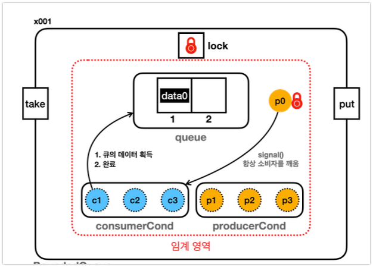

# LockCondition과 BlockingQueue 완전 정리

## 개요
- wait-notify 메커니즘의 근본적인 한계를 ReentrantLock + Condition으로 해결
- 생산자와 소비자의 대기 공간을 분리하여 정확한 스레드만 깨우기
- BlockingQueue를 통한 실용적인 생산자-소비자 패턴 구현

> ReentrantLock + Condition은 synchronized + wait/notify의 모든 문제를 해결하는 현대적 동기화 메커니즘입니다.

## synchronized + wait/notify 문제점 재정리

### 핵심 문제: 하나의 대기 집합 (Wait Set)

```
📝 문제 상황 시각화

          하나의 대기 집합 (Wait Set)
    ┌─────────────────────────────────────────┐
    │  😴 Producer1  😴 Consumer1  😴 Producer2  │
    │  😴 Consumer2  😴 Consumer3  😴 Producer3  │
    └─────────────────────────────────────────┘
                         ↓
                  notify() 호출
                         ↓
            🎲 무작위로 하나만 선택!
                         ↓
        ❌ Consumer가 Consumer를 깨우는 비효율!
```

### 구체적인 문제 시나리오
```java
// 상황: 큐가 비어있음, 소비자들만 대기 중
// 대기집합: [Consumer1, Consumer2, Consumer3, Producer1]

// Consumer1이 작업 완료 후 notify() 호출
consumer1.notify(); // 🎲 랜덤하게 Consumer2를 깨움!

// Consumer2 깨어남
consumer2: "큐를 확인해보니... 여전히 비어있네? 다시 대기..."
consumer2.wait(); // 😴 다시 잠듦

// 결과: 의미없는 작업, Producer1은 여전히 대기 중
```

## ReentrantLock + Condition 해결책

### 핵심 아이디어: 대기 공간 분리



```
🎯 해결책 시각화: 분리된 대기 공간

     Producer 전용 대기 공간        Consumer 전용 대기 공간
   ┌─────────────────────────┐    ┌─────────────────────────┐
   │  😴 Producer1          │    │  😴 Consumer1          │
   │  😴 Producer2          │    │  😴 Consumer2          │
   │  😴 Producer3          │    │  😴 Consumer3          │
   └─────────────────────────┘    └─────────────────────────┘
            ↑                              ↑
    producerCond.await()           consumerCond.await()
            ↑                              ↑
   producerCond.signal()           consumerCond.signal()
            ↑                              ↑
      소비자가 호출                   생산자가 호출
```

### BoundedQueue ReentrantLock 구현

```java
public class BoundedQueueV5<T> {
    private final Queue<T> queue = new ArrayDeque<>();
    private final int max;
    
    // 🔧 핵심: ReentrantLock과 분리된 Condition
    private final Lock lock = new ReentrantLock();
    private final Condition producerCond = lock.newCondition();  // 생산자 전용
    private final Condition consumerCond = lock.newCondition();  // 소비자 전용
    
    // 생산자 메서드
    public void put(T data) throws InterruptedException {
        lock.lock();
        try {
            while (queue.size() == max) {
                log("큐가 가득참, 생산자 대기");
                producerCond.await(); // 🎯 생산자 전용 대기 공간
            }
            queue.offer(data);
            log("생산완료: " + data);
            consumerCond.signal(); // 🎯 소비자만 깨우기!
        } finally {
            lock.unlock();
        }
    }
    
    // 소비자 메서드  
    public T take() throws InterruptedException {
        lock.lock();
        try {
            while (queue.isEmpty()) {
                log("큐가 비어있음, 소비자 대기");
                consumerCond.await(); // 🎯 소비자 전용 대기 공간
            }
            T data = queue.poll();
            log("소비완료: " + data);
            producerCond.signal(); // 🎯 생산자만 깨우기!
            return data;
        } finally {
            lock.unlock();
        }
    }
}
```

### 개선된 동작 과정

```
✅ 정확한 스레드 깨우기 시나리오

T=0: 큐가 비어있음
     Producer1, Producer2는 producerCond에서 대기
     Consumer1, Consumer2는 consumerCond에서 대기
     
     producerCond 대기: [Producer1, Producer2]
     consumerCond 대기: [Consumer1, Consumer2]

T=1: Producer3가 데이터 생산
     consumerCond.signal() 호출
     → Consumer1만 깨어남! ✅
     → Producer들은 계속 대기 (정확함!)
     
T=2: Consumer1이 데이터 소비  
     producerCond.signal() 호출
     → Producer1만 깨어남! ✅
     → 다른 Consumer들은 계속 대기 (정확함!)

🎉 결과: 항상 올바른 타입의 스레드만 깨어남!
```

## 락 대기집합 용어 정리

### synchronized 환경

```
🏢 synchronized 빌딩 구조

          synchronized 메서드/블록
         ┌──────────────────────────────┐
         │                           │
    ┌────▼────┐                ┌─────▼─────┐
    │ Entry   │                │ Wait Set  │
    │ Set     │   wait()       │           │
    │         │ ─────────────→ │           │
    │ BLOCKED │                │ WAITING   │
    └─────────┘ ←───────────── └───────────┘
                   notify()
```

**Entry Set (엔트리 셋)**
- synchronized 블록 진입을 기다리는 스레드들
- 스레드 상태: `BLOCKED`
- 락이 해제되면 자동으로 경쟁하여 하나가 락 획득

**Wait Set (대기 셋)**
- `wait()` 메서드로 조건을 기다리는 스레드들
- 스레드 상태: `WAITING` 또는 `TIMED_WAITING`
- `notify()` 또는 `notifyAll()`로만 깨어남

### ReentrantLock 환경

```
🏢 ReentrantLock 빌딩 구조

    ReentrantLock 대기 큐        Condition 대기 공간들
   ┌─────────────────────┐    ┌─────────────────────┐
   │      WAITING        │    │ producerCond:       │
   │   (락 대기 중)       │    │   WAITING           │
   └─────────────────────┘    │                     │
            ↕                │ consumerCond:       │
      lock()/unlock()         │   WAITING           │
                              └─────────────────────┘
                                      ↕
                               await()/signal()
```

**ReentrantLock 대기 큐**
- `lock()` 호출 시 락이 사용 중이면 대기
- 스레드 상태: `WAITING`
- 락 해제 시 FIFO 순서로 깨어남

**Condition 대기 공간**
- `await()` 호출한 스레드들이 대기
- 스레드 상태: `WAITING` 또는 `TIMED_WAITING`
- `signal()` 또는 `signalAll()`로 깨어남

## Condition의 장점

### 1. 정확성 (Correctness)
```java
// ✅ ReentrantLock + Condition
consumerCond.signal(); // 항상 Consumer만 깨움
producerCond.signal(); // 항상 Producer만 깨움

// ❌ synchronized + notify  
notify(); // 🎲 무작위로 아무나 깨움
```

### 2. 효율성 (Efficiency)
```
📊 성능 비교

synchronized + notify():
- 잘못된 스레드 깨어남: 50% 확률
- 불필요한 컨텍스트 스위칭: 높음
- CPU 낭비: 상당함

ReentrantLock + signal():
- 잘못된 스레드 깨어남: 0%
- 불필요한 컨텍스트 스위칭: 없음  
- CPU 효율: 최적
```

### 3. 유연성 (Flexibility)
```java
// 여러 조건별로 대기 공간 분리 가능
private final Condition notFull = lock.newCondition();
private final Condition notEmpty = lock.newCondition();
private final Condition priority = lock.newCondition();

// 세밀한 제어
if (priority > 5) {
    priority.signal();
} else {
    notEmpty.signal();
}
```

## BlockingQueue: 완성된 해결책

### BlockingQueue 소개

```
🎁 BlockingQueue = ReentrantLock + Condition + Queue의 완전체

   사용자 코드                    BlockingQueue 내부
┌─────────────────┐           ┌──────────────────────────────┐
│ queue.put(data) │ ────────→ │ lock.lock()                 │
│                 │           │ while(queue.isFull())       │
│                 │           │   notFull.await()           │
│                 │           │ queue.add(data)             │
│                 │           │ notEmpty.signal()           │
│                 │           │ lock.unlock()               │
└─────────────────┘           └──────────────────────────────┘
```

### 특징
- 스레드를 **차단(blocking)** 할 수 있는 큐
- **데이터 추가 차단**: 큐가 가득 차면 공간이 생길 때까지 대기
- **데이터 획득 차단**: 큐가 비어있으면 데이터가 들어올 때까지 대기
- 내부적으로 ReentrantLock + Condition으로 구현

### 주요 구현체

```java
// 🏗️ 배열 기반 - 크기 고정
ArrayBlockingQueue<String> arrayQueue = new ArrayBlockingQueue<>(10);

// 🔗 링크 기반 - 크기 선택 가능
LinkedBlockingQueue<String> linkedQueue = new LinkedBlockingQueue<>(); // 무한
LinkedBlockingQueue<String> boundedLinked = new LinkedBlockingQueue<>(100); // 제한
```

## BlockingQueue 메서드 전략

### 4가지 처리 전략

```
📋 BlockingQueue 메서드 매트릭스

╔══════════════╦═══════════════╦══════════════╦══════════╦══════════════════╗
║   Operation  ║ Throws        ║ Special      ║  Blocks   ║    Times Out     ║
║              ║ Exception     ║ Value        ║           ║                  ║
╠══════════════╬═══════════════╬══════════════╬══════════╬══════════════════╣
║ Insert(추가) ║   add(e)      ║  offer(e)    ║  put(e)   ║ offer(e,time,u)  ║
║              ║ 🔥 Exception  ║ 🔄 false     ║ ⏳ 대기   ║ ⏰ 시간제한 대기   ║
╠══════════════╬═══════════════╬══════════════╬══════════╬══════════════════╣
║ Remove(제거) ║  remove()     ║   poll()     ║  take()   ║ poll(time,unit)  ║
║              ║ 🔥 Exception  ║ 🔄 null      ║ ⏳ 대기   ║ ⏰ 시간제한 대기   ║
╠══════════════╬═══════════════╬══════════════╬══════════╬══════════════════╣
║Examine(확인) ║  element()    ║   peek()     ║ 해당 없음  ║    해당 없음      ║
║              ║ 🔥 Exception  ║ 🔄 null      ║           ║                  ║
╚══════════════╩═══════════════╩══════════════╩══════════╩══════════════════╝
```

### 전략별 상세 설명

#### 1. Throws Exception 전략
```java
// 🔥 예외 발생 방식 - 즉시 실패
try {
    queue.add("data");        // 큐 가득참 → IllegalStateException
    String data = queue.remove(); // 큐 비어있음 → NoSuchElementException
} catch (Exception e) {
    log("큐 상태 문제: " + e.getMessage());
}
```

#### 2. Special Value 전략
```java
// 🔄 특별값 반환 방식 - 상태 확인 가능
boolean success = queue.offer("data"); // 가득참 → false
String data = queue.poll();            // 비어있음 → null

if (success) {
    log("데이터 추가 성공");
} else {
    log("큐가 가득참");
}
```

#### 3. Blocks 전략
```java
// ⏳ 대기 방식 - 조건 만족까지 무한 대기
try {
    queue.put("data");    // 공간 생길 때까지 대기
    String data = queue.take(); // 데이터 들어올 때까지 대기
} catch (InterruptedException e) {
    log("대기 중 인터럽트 발생");
}
```

#### 4. Times Out 전략
```java
// ⏰ 시간제한 대기 방식
try {
    boolean success = queue.offer("data", 1, TimeUnit.SECONDS);
    String data = queue.poll(2, TimeUnit.SECONDS);
    
    if (success) {
        log("1초 내 추가 성공");
    } else {
        log("1초 대기 후 포기");
    }
} catch (InterruptedException e) {
    log("대기 중 인터럽트");
}
```

## BlockingQueue 구현 예제 비교

### BoundedQueueV6_1: 완전 대기 방식

```java
public class BoundedQueueV6_1<T> implements BoundedQueue<T> {
    private final BlockingQueue<T> queue;
    
    public BoundedQueueV6_1(int max) {
        this.queue = new ArrayBlockingQueue<>(max);
    }
    
    @Override
    public void put(T data) {
        try {
            queue.put(data); // ⏳ 무한 대기
            log("[" + Thread.currentThread().getName() + "] 저장: " + data);
        } catch (InterruptedException e) {
            throw new RuntimeException(e);
        }
    }
    
    @Override
    public T take() {
        try {
            T data = queue.take(); // ⏳ 무한 대기
            log("[" + Thread.currentThread().getName() + "] 획득: " + data);
            return data;
        } catch (InterruptedException e) {
            throw new RuntimeException(e);
        }
    }
}
```

### BoundedQueueV6_2: 즉시 반환 방식

```java
public class BoundedQueueV6_2<T> implements BoundedQueue<T> {
    private final BlockingQueue<T> queue;
    
    public BoundedQueueV6_2(int max) {
        this.queue = new ArrayBlockingQueue<>(max);
    }
    
    @Override
    public void put(T data) {
        boolean result = queue.offer(data); // 🔄 즉시 반환
        if (result) {
            log("[" + Thread.currentThread().getName() + "] 저장 성공: " + data);
        } else {
            log("[" + Thread.currentThread().getName() + "] 저장 실패: 큐 가득참");
        }
    }
    
    @Override
    public T take() {
        T data = queue.poll(); // 🔄 즉시 반환
        if (data != null) {
            log("[" + Thread.currentThread().getName() + "] 획득 성공: " + data);
        } else {
            log("[" + Thread.currentThread().getName() + "] 획득 실패: 큐 비어있음");
        }
        return data;
    }
}
```

### BoundedQueueV6_3: 시간 제한 방식

```java
public class BoundedQueueV6_3<T> implements BoundedQueue<T> {
    private final BlockingQueue<T> queue;
    
    public BoundedQueueV6_3(int max) {
        this.queue = new ArrayBlockingQueue<>(max);
    }
    
    @Override
    public void put(T data) {
        try {
            // ⏰ 1나노초만 대기 (거의 즉시 포기)
            boolean result = queue.offer(data, 1, TimeUnit.NANOSECONDS);
            if (result) {
                log("저장 성공: " + data);
            } else {
                log("저장 실패: 시간 초과");
            }
        } catch (InterruptedException e) {
            throw new RuntimeException(e);
        }
    }
    
    @Override
    public T take() {
        try {
            // ⏰ 2초 대기
            T data = queue.poll(2, TimeUnit.SECONDS);
            if (data != null) {
                log("획득 성공: " + data);
            } else {
                log("획득 실패: 2초 시간 초과");
            }
            return data;
        } catch (InterruptedException e) {
            throw new RuntimeException(e);
        }
    }
}
```

## 실행 결과 비교

### 완전 대기 방식 (V6_1)
```
🕐 실행 로그
[producer1] 저장: data1
[producer1] 저장: data2  
[producer1] 저장 대기... (큐 가득참)
[consumer1] 획득: data1
[producer1] 저장: data3  (대기 해제)
[consumer1] 획득: data2
```

### 즉시 반환 방식 (V6_2)
```
🕐 실행 로그
[producer1] 저장 성공: data1
[producer1] 저장 성공: data2
[producer1] 저장 실패: 큐 가득참
[consumer1] 획득 성공: data1
[consumer1] 획득 성공: data2
[consumer1] 획득 실패: 큐 비어있음
```

### 시간 제한 방식 (V6_3)
```
🕐 실행 로그
[producer1] 저장 성공: data1
[producer1] 저장 성공: data2
[producer1] 저장 실패: 시간 초과
[consumer1] 획득 성공: data1
[consumer1] 획득 성공: data2
[consumer1] 획득 실패: 2초 시간 초과
```

## Doug Lea의 기여

```
👨‍💻 Doug Lea: java.util.concurrent의 아버지

┌───────────────────────────────────────────────────────────┐
│                  주요 기여 사항                          │
├───────────────────────────────────────────────────────────┤
│ • JSR-166 주도 (Java Concurrency Utilities)            │
│ • ReentrantLock, Condition 설계 및 구현                │
│ • BlockingQueue 인터페이스 및 구현체들 설계              │
│ • ThreadPoolExecutor, CountDownLatch 등 고급 도구       │
│ • Fork/Join Framework 설계 (Java 7)                   │
│ • StampedLock 설계 (Java 8)                           │
└───────────────────────────────────────────────────────────┘

🎯 핵심 철학:
"복잡한 동시성 문제를 간단하고 안전하게 해결할 수 있는 도구 제공"
```

**주요 성과:**
- **안전성**: 데드락, 레이스 컨디션 등의 동시성 버그 방지
- **성능**: 고도로 최적화된 비차단(non-blocking) 알고리즘 구현
- **사용성**: 직관적이고 일관성 있는 API 설계
- **검증**: 수년간의 실전 사용과 학술적 검증을 통한 안정성 확보

## 스레드 상태 비교 정리

### synchronized vs ReentrantLock

```
📊 스레드 상태 매핑 비교

┌───────────────────────────────────────────────────────────────────┐
│                    synchronized 환경                           │
├─────────────────────┬─────────────────────────────────────────────┤
│ 락 획득 대기        │ Entry Set → BLOCKED 상태                │
│ 조건 대기          │ Wait Set → WAITING/TIMED_WAITING 상태   │
└─────────────────────┴─────────────────────────────────────────────┘

┌───────────────────────────────────────────────────────────────────┐
│                  ReentrantLock 환경                           │
├─────────────────────┬─────────────────────────────────────────────┤
│ 락 획득 대기        │ ReentrantLock Queue → WAITING 상태      │
│ 조건 대기          │ Condition Queue → WAITING/TIMED_WAITING │
└─────────────────────┴─────────────────────────────────────────────┘
```

**핵심 차이점:**
1. **대기 공간**: synchronized(1개) vs ReentrantLock(N개)
2. **선택적 깨우기**: notify(무작위) vs signal(정확)
3. **상태 관리**: BLOCKED vs WAITING (더 일관성 있음)
4. **공정성**: 기본적으로 불공정 vs 공정/불공정 선택 가능

## 실무 권장사항

### 선택 가이드라인

```
🎯 언제 무엇을 사용할까?

┌─────────────────────┬──────────────────────────────────────────┐
│     상황            │                권장 사항                 │
├─────────────────────┼──────────────────────────────────────────┤
│ 간단한 동기화       │ synchronized (간단함)                   │
│ 복잡한 조건 대기    │ ReentrantLock + Condition (정확성)      │
│ 생산자-소비자 패턴  │ BlockingQueue (검증된 솔루션)           │
│ 고성능 요구사항     │ Lock-free 자료구조 (ConcurrentHashMap)  │
│ 학습 목적          │ 직접 구현 → BlockingQueue 순서          │
└─────────────────────┴──────────────────────────────────────────┘
```

### 최종 권장사항

1. **학습 단계**: synchronized → ReentrantLock → BlockingQueue 순서로 이해
2. **실무 단계**: 검증된 `java.util.concurrent` 패키지 적극 활용
3. **성능 최적화**: 프로파일링 후 필요시에만 고급 기법 적용
4. **코드 리뷰**: 동시성 코드는 반드시 동료 검토 필수

```
💡 핵심 메시지

"바퀴를 다시 발명하지 마세요.
 Doug Lea가 이미 완벽하게 만들어 놓았습니다."

- 직접 구현: 학습과 이해를 위해
- 실무 사용: 검증된 라이브러리 활용
```