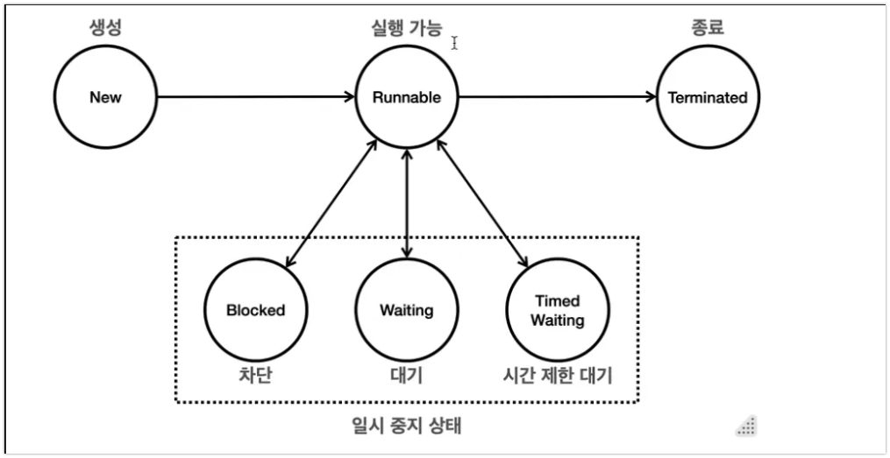

# 🧬 Java Thread 생명주기 완전 가이드

---



## 1. Thread State 상세 분석

### 📊 Thread State 전환 다이어그램
```
NEW → start() → RUNNABLE ⟷ CPU 스케줄링
                    ↓
           ┌────────────────────────────┐
           ▼                            │
      [일시 중지 상태]                  │
      ├─ BLOCKED (동기화 락 대기)      │
      ├─ WAITING (무기한 대기)          │
      └─ TIMED_WAITING (시간제한 대기)  │
           │                            │
           └────────────────────────────┘
                    ↓
               TERMINATED (종료)
```

### 🎯 각 상태별 상세 분석

| State | 한글명 | 설명 | 진입 조건 | 탈출 조건 | CPU 할당 |
|-------|--------|------|----------|----------|----------|
| **NEW** | 생성 | 스레드 객체는 생성되었지만 아직 start() 호출 전 | `new Thread()` | `start()` 호출 | ❌ |
| **RUNNABLE** | 실행가능 | CPU 할당을 받을 수 있는 상태 (대기 중이거나 실행 중) | `start()` 호출<br/>대기 상태에서 조건 해제 | 일시 중지 조건 충족<br/>실행 완료 | ✅ |
| **BLOCKED** | 차단 | 동기화 락을 기다리는 상태 | `synchronized` 블록/메서드 진입 시도 | 락 획득 성공 | ❌ |
| **WAITING** | 대기 | 다른 스레드의 특정 작업을 무기한 기다림 | `wait()`<br/>`join()`<br/>`park()` | `notify()/notifyAll()`<br/>대상 스레드 종료<br/>`unpark()` | ❌ |
| **TIMED_WAITING** | 시간제한대기 | 지정된 시간 동안 대기 | `sleep(timeout)`<br/>`wait(timeout)`<br/>`join(timeout)` | 시간 초과<br/>조건 충족 | ❌ |
| **TERMINATED** | 종료 | 스레드 실행 완료 또는 예외로 인한 종료 | `run()` 메서드 완료<br/>처리되지 않은 예외 | 영구적 (복구 불가) | ❌ |

---

## 2. 상태 전환 시나리오 분석

### 🔄 시나리오 1: 정상적인 스레드 실행
```java
Thread thread = new Thread(() -> {
    System.out.println("작업 시작");    // RUNNABLE
    try {
        Thread.sleep(1000);           // TIMED_WAITING
        System.out.println("작업 완료"); // RUNNABLE
    } catch (InterruptedException e) {
        System.out.println("인터럽트됨");
    }
});                                    // NEW

thread.start();                       // NEW → RUNNABLE
// 1초 후 자동으로 TERMINATED
```

**상태 변화**: `NEW` → `RUNNABLE` → `TIMED_WAITING` → `RUNNABLE` → `TERMINATED`

### 🔄 시나리오 2: 동기화 락 경합
```java
Object lock = new Object();

// 스레드 1
Thread t1 = new Thread(() -> {
    synchronized (lock) {             // RUNNABLE (락 획득 성공)
        try {
            Thread.sleep(3000);       // TIMED_WAITING
        } catch (InterruptedException e) {}
    }
});

// 스레드 2  
Thread t2 = new Thread(() -> {
    synchronized (lock) {             // BLOCKED (락 대기)
        System.out.println("실행됨");   // RUNNABLE (락 획득 후)
    }
});
```

**t2 상태 변화**: `NEW` → `RUNNABLE` → `BLOCKED` → `RUNNABLE` → `TERMINATED`

### 🔄 시나리오 3: wait/notify 패턴
```java
Object monitor = new Object();

// 생산자 스레드
Thread producer = new Thread(() -> {
    synchronized (monitor) {
        // 작업 수행
        monitor.notify();             // 대기 중인 스레드 깨움
    }
});

// 소비자 스레드
Thread consumer = new Thread(() -> {
    synchronized (monitor) {
        try {
            monitor.wait();           // WAITING 상태로 전환
            // notify 받으면 RUNNABLE로 복귀
        } catch (InterruptedException e) {}
    }
});
```

**consumer 상태 변화**: `NEW` → `RUNNABLE` → `WAITING` → `RUNNABLE` → `TERMINATED`

---

## 3. RUNNABLE 상태 심화 분석

### 🧐 RUNNABLE의 두 가지 하위 상태

RUNNABLE 상태는 실제로 두 가지 내부 상태를 포함:

| 내부 상태 | 설명 | 특징 |
|----------|------|------|
| **Running** | CPU에서 실제 실행 중 | 한 번에 하나의 스레드만 가능 (싱글 코어 기준) |
| **Ready** | 실행 가능하지만 CPU 대기 중 | CPU 스케줄러의 실행 대기열에서 순서 대기 |

```java
// 100개의 RUNNABLE 스레드가 있어도
// 실제 CPU에서 Running 상태는 코어 수만큼만 가능
for (int i = 0; i < 100; i++) {
    new Thread(() -> {
        while (true) {
            // 모든 스레드가 RUNNABLE 상태
            // 하지만 실제 Running은 CPU 코어 수만큼
            System.out.println("실행 중: " + Thread.currentThread().getName());
        }
    }).start();
}
```

### ⚡ CPU 스케줄링과 상태 변화

```java
// 시간 분할(Time Slicing) 예시
Thread thread = new Thread(() -> {
    for (int i = 0; i < 1000000; i++) {
        // RUNNABLE 상태 유지
        // 하지만 내부적으로는 Running ⟷ Ready 반복
        if (i % 100000 == 0) {
            System.out.println("진행률: " + (i / 10000) + "%");
        }
    }
});
```

**내부 변화**: `Ready` → `Running` → `Ready` → `Running` → ... (빠른 반복)  
**Java에서 관찰**: 계속 `RUNNABLE` 상태로 표시

---

## 4. 일시 중지 상태 비교 분석

### 📋 BLOCKED vs WAITING vs TIMED_WAITING

| 구분 | BLOCKED | WAITING | TIMED_WAITING |
|------|---------|---------|---------------|
| **원인** | 동기화 락 경합 | 명시적 대기 호출 | 시간 제한 대기 호출 |
| **해제 조건** | 락 획득 | 외부 신호 (notify 등) | 시간 초과 또는 조건 충족 |
| **제어 가능성** | 수동적 (락 보유자가 해제) | 능동적 (notify로 제어) | 반자동적 (시간으로 보장) |
| **대표 메서드** | `synchronized` 진입 | `wait()`, `join()` | `sleep()`, `wait(timeout)` |
| **인터럽트 반응** | 반응 안함 | `InterruptedException` | `InterruptedException` |

### 🔍 실제 동작 차이점

```java
// 1. BLOCKED 상태 - 인터럽트에 반응하지 않음
Thread blockedThread = new Thread(() -> {
    synchronized (lock) { // 다른 스레드가 lock 보유중이면 BLOCKED
        System.out.println("락 획득");
    }
});

// 2. WAITING 상태 - 인터럽트에 즉시 반응
Thread waitingThread = new Thread(() -> {
    synchronized (monitor) {
        try {
            monitor.wait(); // WAITING 상태
        } catch (InterruptedException e) { // 인터럽트 시 즉시 예외
            System.out.println("대기 중 인터럽트됨");
        }
    }
});

// 3. TIMED_WAITING 상태 - 시간 또는 인터럽트로 해제
Thread timedThread = new Thread(() -> {
    try {
        Thread.sleep(5000); // TIMED_WAITING - 5초 또는 인터럽트까지
    } catch (InterruptedException e) {
        System.out.println("수면 중 인터럽트됨");
    }
});
```

---

## 5. 메서드별 상태 변화 매트릭스

### 🎯 주요 메서드와 상태 전환

| 메서드 | 호출 전 상태 | 호출 후 상태 | 해제 조건 | 예외 발생 |
|--------|-------------|-------------|----------|-----------|
| `start()` | NEW | RUNNABLE | 즉시 | IllegalThreadStateException |
| `sleep(ms)` | RUNNABLE | TIMED_WAITING | 시간 초과/인터럽트 | InterruptedException |
| `wait()` | RUNNABLE | WAITING | notify/notifyAll/인터럽트 | InterruptedException |
| `wait(timeout)` | RUNNABLE | TIMED_WAITING | 시간 초과/notify/인터럽트 | InterruptedException |
| `join()` | RUNNABLE | WAITING | 대상 스레드 종료/인터럽트 | InterruptedException |
| `join(timeout)` | RUNNABLE | TIMED_WAITING | 시간 초과/대상 종료/인터럽트 | InterruptedException |
| `yield()` | RUNNABLE | RUNNABLE | 즉시 (힌트만 제공) | 없음 |
| `interrupt()` | 모든 상태 | 상태 변화 없음 | 대기 메서드에서 예외 발생 | 없음 |

---

## 6. 상태 확인 및 디버깅

### 🔍 Thread 상태 모니터링

```java
public class ThreadStateMonitor {
    public static void monitorThread(Thread thread, String description) {
        System.out.printf("[%s] %s - 상태: %s%n", 
            System.currentTimeMillis(), 
            description, 
            thread.getState()
        );
    }
    
    public static void main(String[] args) {
        Thread worker = new Thread(() -> {
            try {
                Thread.sleep(2000);
                synchronized (ThreadStateMonitor.class) {
                    ThreadStateMonitor.class.wait(1000);
                }
            } catch (InterruptedException e) {
                System.out.println("작업 중단됨");
            }
        });
        
        monitorThread(worker, "생성 직후");           // NEW
        worker.start();
        monitorThread(worker, "시작 직후");           // RUNNABLE
        
        try {
            Thread.sleep(100);
            monitorThread(worker, "sleep 중");        // TIMED_WAITING
            
            Thread.sleep(2500);
            monitorThread(worker, "wait 중");         // TIMED_WAITING
            
            worker.join();
            monitorThread(worker, "완료 후");         // TERMINATED
        } catch (InterruptedException e) {
            e.printStackTrace();
        }
    }
}
```

### 📊 실행 결과 예시
```
[1640995200000] 생성 직후 - 상태: NEW
[1640995200001] 시작 직후 - 상태: RUNNABLE
[1640995200101] sleep 중 - 상태: TIMED_WAITING
[1640995202601] wait 중 - 상태: TIMED_WAITING  
[1640995203601] 완료 후 - 상태: TERMINATED
```

---

## 7. 실전 패턴과 베스트 프랙티스

### ✅ 상태별 권장 사용법

| 상태 | 권장 사용 시나리오 | 주의사항 |
|------|------------------|----------|
| **NEW** | 스레드 생성 후 설정 작업 | start() 한 번만 호출 가능 |
| **RUNNABLE** | 실제 작업 수행 | CPU 집약적 작업 시 yield() 고려 |
| **BLOCKED** | 동기화가 필요한 공유 자원 접근 | 데드락 주의 |
| **WAITING** | 이벤트 기반 동기화 | spurious wakeup 대비 |
| **TIMED_WAITING** | 주기적 작업, 타임아웃 필요 시 | 시간 설정 신중히 |
| **TERMINATED** | 리소스 정리, 결과 수집 | 재시작 불가능 |

### 🚨 피해야 할 안티패턴

```java
// ❌ 잘못된 예: 무한 루프에서 상태 체크
while (someCondition) {
    if (Thread.currentThread().getState() == Thread.State.RUNNABLE) {
        // 상태 기반 로직 - 권장하지 않음
    }
    Thread.yield(); // 무의미한 yield 호출
}

// ✅ 올바른 예: 조건 변수 사용
synchronized (condition) {
    while (!ready) {
        condition.wait(); // 명확한 대기 조건
    }
    // 실제 작업 수행
}
```

---

## 8. 성능 고려사항

### ⚡ 상태 전환 비용

| 전환 유형 | 비용 | 설명 |
|----------|------|------|
| RUNNABLE → RUNNABLE | 매우 낮음 | yield(), 스케줄링 |
| RUNNABLE → TIMED_WAITING | 낮음 | sleep(), wait(timeout) |
| RUNNABLE → WAITING | 낮음 | wait(), join() |
| RUNNABLE → BLOCKED | 중간 | synchronized 진입 |
| 대기 → RUNNABLE | 중간~높음 | 컨텍스트 스위칭 비용 |

### 🎯 최적화 팁

1. **불필요한 상태 전환 최소화**
   ```java
   // ❌ 빈번한 sleep
   while (running) {
       doWork();
       Thread.sleep(1); // 매우 비효율적
   }
   
   // ✅ 조건 기반 대기
   while (running) {
       if (hasWork()) {
           doWork();
       } else {
           synchronized (workQueue) {
               workQueue.wait(); // 작업이 있을 때까지 대기
           }
       }
   }
   ```

2. **적절한 대기 시간 설정**
   ```java
   // ❌ 너무 짧은 대기
   Thread.sleep(1);  // 컨텍스트 스위칭 오버헤드
   
   // ❌ 너무 긴 대기  
   Thread.sleep(60000); // 반응성 저하
   
   // ✅ 적절한 대기
   Thread.sleep(100);   // 균형잡힌 대기 시간
   ```

---

## 9. 요약

### 🎯 핵심 포인트

1. **상태는 전환 비용이 있다** - 불필요한 전환 최소화
2. **RUNNABLE ≠ 실제 실행 중** - CPU 스케줄링 이해 필요  
3. **일시 중지 상태는 인터럽트 처리 방식이 다르다** - BLOCKED vs WAITING/TIMED_WAITING
4. **상태 기반 로직보다는 조건 변수 사용** - 더 안전하고 효율적
5. **데드락 방지가 최우선** - 상태 전환 순서 신중히 설계

**🚀 실전 권장사항:**
- 상태 모니터링 툴 활용으로 디버깅 효율성 향상
- 적절한 대기 전략으로 CPU 효율성과 반응성 균형 유지
- 예외 처리를 통한 안전한 상태 전환 보장


# 🔗 Thread Join 완전 가이드

---

## 1. Thread Join 개념과 동작 원리

### 🎯 Join이란?
**Thread Join**은 **한 스레드가 다른 스레드의 완료를 기다리는 동기화 메커니즘**입니다.

```java
// 기본 개념
Thread workerThread = new Thread(() -> {
    // 작업 수행
});

workerThread.start();
workerThread.join(); // ← 메인 스레드가 workerThread 완료까지 대기
```

### 📊 Join 메서드 종류와 특징

| 메서드 | 반환 타입 | 대기 상태 | 설명 | 사용 시나리오 |
|--------|-----------|-----------|------|---------------|
| `join()` | void | WAITING | 대상 스레드가 종료될 때까지 무한 대기 | 필수 작업 완료 대기 |
| `join(long millis)` | void | TIMED_WAITING | 지정 시간만큼 대기, 시간 초과 시 복귀 | 타임아웃이 필요한 작업 |
| `join(long millis, int nanos)` | void | TIMED_WAITING | 밀리초 + 나노초 단위의 정밀한 대기 | 고정밀 타이밍 제어 |

### 🔄 상태 전환 다이어그램

```
호출 스레드 (caller):
RUNNABLE → target.join() → WAITING/TIMED_WAITING → target 종료 → RUNNABLE

대상 스레드 (target):
독립적으로 실행 → run() 메서드 완료 → TERMINATED (호출 스레드 깨움)
```

---

## 2. Join 동작 메커니즘 상세 분석

### 🧐 내부 동작 원리

```java
// Thread.join()의 내부 동작 (단순화 버전)
public final void join() throws InterruptedException {
    synchronized (this) {
        while (isAlive()) {  // 스레드가 살아있는 동안
            wait(0);         // 현재 스레드를 WAITING 상태로
        }
        // 스레드가 죽으면 자동으로 notify() 호출됨
    }
}
```

**핵심 포인트:**
1. `join()`은 **내부적으로 wait/notify 메커니즘** 사용
2. 대상 스레드가 종료되면 **자동으로 notify() 호출**
3. 호출 스레드는 **synchronized 블록에서 대기**

### ⚡ 시간 기반 Join의 동작

```java
public final void join(long millis) throws InterruptedException {
    synchronized (this) {
        long startTime = System.currentTimeMillis();
        long remaining = millis;
        
        while (isAlive() && remaining > 0) {
            wait(remaining);  // 남은 시간만큼 대기
            remaining = millis - (System.currentTimeMillis() - startTime);
        }
    }
}
```

---

## 3. 실전 시나리오별 Join 활용

### 🔄 시나리오 1: 순차 실행 보장

```java
public class SequentialExecution {
    public static void main(String[] args) {
        System.out.println("=== 순차 실행 보장 예제 ===");
        
        Thread step1 = new Thread(() -> {
            System.out.println("[Step 1] 데이터 로딩 시작");
            timeSleep(2000);
            System.out.println("[Step 1] 데이터 로딩 완료");
        });
        
        Thread step2 = new Thread(() -> {
            System.out.println("[Step 2] 데이터 처리 시작");
            timeSleep(1500);
            System.out.println("[Step 2] 데이터 처리 완료");
        });
        
        Thread step3 = new Thread(() -> {
            System.out.println("[Step 3] 결과 저장 시작");
            timeSleep(1000);
            System.out.println("[Step 3] 결과 저장 완료");
        });
        
        try {
            // 순차적 실행 보장
            step1.start();
            step1.join();    // Step 1 완료까지 대기
            
            step2.start();
            step2.join();    // Step 2 완료까지 대기
            
            step3.start();
            step3.join();    // Step 3 완료까지 대기
            
            System.out.println("모든 단계 완료!");
        } catch (InterruptedException e) {
            System.out.println("작업이 중단되었습니다.");
        }
    }
}
```

**실행 결과:**
```
=== 순차 실행 보장 예제 ===
[Step 1] 데이터 로딩 시작
[Step 1] 데이터 로딩 완료
[Step 2] 데이터 처리 시작
[Step 2] 데이터 처리 완료
[Step 3] 결과 저장 시작
[Step 3] 결과 저장 완료
모든 단계 완료!
```

### 🔄 시나리오 2: 병렬 작업 후 결과 수집

```java
public class ParallelWorkCollection {
    public static void main(String[] args) {
        System.out.println("=== 병렬 작업 후 결과 수집 ===");
        
        List<Integer> results = Collections.synchronizedList(new ArrayList<>());
        List<Thread> workers = new ArrayList<>();
        
        // 5개의 워커 스레드 생성
        for (int i = 1; i <= 5; i++) {
            final int workerId = i;
            Thread worker = new Thread(() -> {
                System.out.printf("[Worker %d] 작업 시작%n", workerId);
                
                // 각기 다른 시간의 작업 시뮬레이션
                timeSleep(workerId * 500);
                
                int result = workerId * workerId;
                results.add(result);
                
                System.out.printf("[Worker %d] 작업 완료 - 결과: %d%n", workerId, result);
            });
            
            workers.add(worker);
            worker.start(); // 모든 워커를 동시에 시작
        }
        
        try {
            // 모든 워커의 완료를 기다림
            for (Thread worker : workers) {
                worker.join();
            }
            
            // 결과 수집 및 출력
            System.out.println("=== 최종 결과 ===");
            System.out.println("수집된 결과: " + results);
            System.out.println("결과 합계: " + results.stream().mapToInt(Integer::intValue).sum());
            
        } catch (InterruptedException e) {
            System.out.println("작업 수집 중 중단되었습니다.");
        }
    }
}
```

**실행 결과:**
```
=== 병렬 작업 후 결과 수집 ===
[Worker 1] 작업 시작
[Worker 2] 작업 시작
[Worker 3] 작업 시작
[Worker 4] 작업 시작
[Worker 5] 작업 시작
[Worker 1] 작업 완료 - 결과: 1
[Worker 2] 작업 완료 - 결과: 4
[Worker 3] 작업 완료 - 결과: 9
[Worker 4] 작업 완료 - 결과: 16
[Worker 5] 작업 완료 - 결과: 25
=== 최종 결과 ===
수집된 결과: [1, 4, 9, 16, 25]
결과 합계: 55
```

### 🔄 시나리오 3: 타임아웃이 있는 Join

```java
public class TimeoutJoinExample {
    public static void main(String[] args) {
        System.out.println("=== 타임아웃 Join 예제 ===");
        
        Thread longRunningTask = new Thread(() -> {
            System.out.println("[Task] 긴 작업 시작");
            timeSleep(5000); // 5초 작업
            System.out.println("[Task] 긴 작업 완료");
        });
        
        longRunningTask.start();
        
        try {
            System.out.println("[Main] 최대 3초까지만 기다림");
            
            // 3초 동안만 대기
            longRunningTask.join(3000);
            
            if (longRunningTask.isAlive()) {
                System.out.println("[Main] 타임아웃! 작업이 아직 진행 중");
                System.out.println("[Main] 작업을 강제 중단");
                longRunningTask.interrupt();
                
                // 중단 후 정리 대기 (최대 1초)
                longRunningTask.join(1000);
                
                if (longRunningTask.isAlive()) {
                    System.out.println("[Main] 강제 종료 실패 - 데몬 스레드로 처리 필요");
                }
            } else {
                System.out.println("[Main] 작업이 정상적으로 완료됨");
            }
            
        } catch (InterruptedException e) {
            System.out.println("[Main] 대기 중 인터럽트됨");
        }
        
        System.out.println("[Main] 메인 스레드 종료");
    }
}
```

---

## 4. Join vs 다른 동기화 메커니즘 비교

### 📋 동기화 방법 비교표

| 방법 | 용도 | 장점 | 단점 | 적합한 시나리오 |
|------|------|------|------|-----------------|
| **Thread.join()** | 스레드 완료 대기 | 간단, 직관적 | 스레드별로만 가능 | 순차 실행, 결과 수집 |
| **CountDownLatch** | N개 작업 완료 대기 | 유연한 카운팅 | 재사용 불가 | 여러 작업의 일괄 대기 |
| **Future.get()** | 결과값 대기 | 결과 반환 가능 | ExecutorService 필요 | 비동기 작업 결과 처리 |
| **CompletableFuture** | 비동기 작업 체이닝 | 체이닝 가능, 조합 가능 | 복잡성 증가 | 복잡한 비동기 워크플로우 |

### 🔍 실제 비교 예제

```java
// 1. Thread.join() 방식
public void joinApproach() throws InterruptedException {
    List<Thread> threads = createWorkerThreads();
    threads.forEach(Thread::start);
    
    for (Thread thread : threads) {
        thread.join(); // 각 스레드 완료 대기
    }
}

// 2. CountDownLatch 방식
public void countDownLatchApproach() throws InterruptedException {
    int threadCount = 5;
    CountDownLatch latch = new CountDownLatch(threadCount);
    
    for (int i = 0; i < threadCount; i++) {
        new Thread(() -> {
            doWork();
            latch.countDown(); // 작업 완료 시그널
        }).start();
    }
    
    latch.await(); // 모든 작업 완료 대기
}

// 3. CompletableFuture 방식
public void completableFutureApproach() {
    List<CompletableFuture<Void>> futures = IntStream.range(0, 5)
        .mapToObj(i -> CompletableFuture.runAsync(this::doWork))
        .collect(Collectors.toList());
    
    CompletableFuture.allOf(futures.toArray(new CompletableFuture[0]))
        .join(); // 모든 작업 완료 대기
}
```

---

## 5. Join 사용 시 주의사항과 함정

### 🚨 데드락 위험

```java
// ❌ 위험한 패턴: 상호 Join으로 인한 데드락
public class DeadlockExample {
    public static void main(String[] args) {
        Thread thread1 = new Thread(() -> {
            System.out.println("Thread 1 시작");
            try {
                Thread.sleep(1000);
                thread2.join(); // ← Thread 2 완료 대기
            } catch (InterruptedException e) {}
            System.out.println("Thread 1 완료");
        });
        
        Thread thread2 = new Thread(() -> {
            System.out.println("Thread 2 시작");
            try {
                Thread.sleep(1000);
                thread1.join(); // ← Thread 1 완료 대기 (데드락!)
            } catch (InterruptedException e) {}
            System.out.println("Thread 2 완료");
        });
        
        thread1.start();
        thread2.start();
        // 두 스레드가 서로를 기다려 영원히 대기
    }
}

// ✅ 안전한 패턴: 계층적 Join
public class SafeJoinExample {
    public static void main(String[] args) throws InterruptedException {
        Thread worker1 = new Thread(() -> doWork(1));
        Thread worker2 = new Thread(() -> doWork(2));
        
        worker1.start();
        worker2.start();
        
        // 메인 스레드에서 일괄 대기 (계층적 구조)
        worker1.join();
        worker2.join();
        
        System.out.println("모든 작업 완료");
    }
}
```

### ⚠️ 인터럽트 처리

```java
public class InterruptHandlingExample {
    public static void main(String[] args) {
        Thread longRunningThread = new Thread(() -> {
            try {
                Thread.sleep(10000); // 10초 작업
            } catch (InterruptedException e) {
                System.out.println("작업이 중단됨");
                return; // 정상적으로 종료
            }
            System.out.println("작업 완료");
        });
        
        longRunningThread.start();
        
        // 다른 스레드에서 메인 스레드를 인터럽트
        new Thread(() -> {
            try {
                Thread.sleep(2000);
                Thread.currentThread().interrupt(); // 메인 스레드 인터럽트
            } catch (InterruptedException e) {}
        }).start();
        
        try {
            longRunningThread.join(); // 이 호출이 인터럽트될 수 있음
        } catch (InterruptedException e) {
            System.out.println("Join이 인터럽트됨");
            longRunningThread.interrupt(); // 대상 스레드도 인터럽트
        }
    }
}
```

### 🔍 스레드 상태 확인 패턴

```java
public class ThreadStateCheckExample {
    public static void main(String[] args) throws InterruptedException {
        Thread worker = new Thread(() -> {
            for (int i = 0; i < 5; i++) {
                System.out.printf("작업 진행: %d/5%n", i + 1);
                try {
                    Thread.sleep(1000);
                } catch (InterruptedException e) {
                    System.out.println("작업 중단됨");
                    return;
                }
            }
        });
        
        worker.start();
        
        // 주기적으로 상태 확인
        while (worker.isAlive()) {
            System.out.printf("워커 스레드 상태: %s%n", worker.getState());
            Thread.sleep(500);
        }
        
        worker.join(); // 이미 종료된 스레드라도 join() 호출 가능
        System.out.printf("최종 상태: %s%n", worker.getState()); // TERMINATED
    }
}
```

---

## 6. 고급 Join 패턴

### 🎯 패턴 1: 조건부 Join

```java
public class ConditionalJoinExample {
    private static volatile boolean shouldWait = true;
    
    public static void main(String[] args) throws InterruptedException {
        Thread conditionalWorker = new Thread(() -> {
            if (shouldWait) {
                System.out.println("조건이 참이므로 작업 실행");
                timeSleep(2000);
                System.out.println("조건부 작업 완료");
            } else {
                System.out.println("조건이 거짓이므로 즉시 종료");
            }
        });
        
        conditionalWorker.start();
        
        // 조건에 따라 Join 여부 결정
        if (shouldWait) {
            System.out.println("조건부 워커 완료 대기 중...");
            conditionalWorker.join();
        } else {
            System.out.println("대기하지 않고 계속 진행");
        }
        
        System.out.println("메인 스레드 완료");
    }
}
```

### 🎯 패턴 2: Join with Progress Monitoring

```java
public class ProgressMonitoringJoin {
    public static void main(String[] args) throws InterruptedException {
        AtomicInteger progress = new AtomicInteger(0);
        final int totalWork = 100;
        
        Thread worker = new Thread(() -> {
            for (int i = 0; i < totalWork; i++) {
                // 작업 시뮬레이션
                try {
                    Thread.sleep(50);
                } catch (InterruptedException e) {
                    break;
                }
                progress.incrementAndGet();
            }
        });
        
        worker.start();
        
        // 진행률 모니터링하며 대기
        while (worker.isAlive()) {
            int currentProgress = progress.get();
            int percentage = (currentProgress * 100) / totalWork;
            System.out.printf("\r진행률: %d%% [%s]", 
                percentage, 
                "=".repeat(percentage / 5) + " ".repeat(20 - percentage / 5)
            );
            
            Thread.sleep(200);
        }
        
        worker.join(); // 최종 완료 확인
        System.out.println("\n작업 완료!");
    }
}
```

### 🎯 패턴 3: Graceful Shutdown with Join

```java
public class GracefulShutdownExample {
    private static volatile boolean running = true;
    
    public static void main(String[] args) throws InterruptedException {
        List<Thread> workers = new ArrayList<>();
        
        // 여러 워커 스레드 시작
        for (int i = 0; i < 3; i++) {
            final int workerId = i;
            Thread worker = new Thread(() -> {
                while (running && !Thread.currentThread().isInterrupted()) {
                    System.out.printf("Worker %d 작업 중...%n", workerId);
                    try {
                        Thread.sleep(1000);
                    } catch (InterruptedException e) {
                        System.out.printf("Worker %d 인터럽트됨%n", workerId);
                        break;
                    }
                }
                System.out.printf("Worker %d 종료%n", workerId);
            });
            
            workers.add(worker);
            worker.start();
        }
        
        // 3초 후 Graceful Shutdown 시작
        Thread.sleep(3000);
        System.out.println("=== Graceful Shutdown 시작 ===");
        
        // 1단계: 종료 신호 전송
        running = false;
        
        // 2단계: 모든 워커에 인터럽트 전송
        workers.forEach(Thread::interrupt);
        
        // 3단계: 모든 워커의 종료 대기 (타임아웃 포함)
        for (Thread worker : workers) {
            worker.join(2000); // 최대 2초 대기
            if (worker.isAlive()) {
                System.out.printf("Worker %s 강제 종료 필요%n", worker.getName());
            }
        }
        
        System.out.println("=== 모든 워커 종료 완료 ===");
    }
}
```

---

## 7. 성능 고려사항

### ⚡ Join 성능 분석

| 시나리오 | 성능 특성 | 권장사항 |
|----------|-----------|----------|
| **소수 스레드 Join** | 오버헤드 거의 없음 | 그대로 사용 |
| **대량 스레드 Join** | 순차 대기로 인한 지연 | ExecutorService + CountDownLatch 고려 |
| **빈번한 Join 호출** | 컨텍스트 스위칭 비용 | 배치 처리로 호출 빈도 줄이기 |
| **타임아웃 Join** | 추가 타이머 관리 비용 | 필요시에만 사용 |

### 🎯 성능 최적화 팁

```java
// ❌ 비효율적: 순차적 Join
public void inefficientJoin() throws InterruptedException {
    List<Thread> threads = createManyThreads(1000);
    
    for (Thread thread : threads) {
        thread.start();
        thread.join(); // 하나씩 순차 대기 - 비효율적!
    }
}

// ✅ 효율적: 일괄 시작 후 일괄 대기
public void efficientJoin() throws InterruptedException {
    List<Thread> threads = createManyThreads(1000);
    
    // 모든 스레드 일괄 시작
    threads.forEach(Thread::start);
    
    // 모든 스레드 일괄 대기
    for (Thread thread : threads) {
        thread.join();
    }
}

// 🚀 최적화: ExecutorService 사용
public void optimizedApproach() throws InterruptedException {
    ExecutorService executor = Executors.newFixedThreadPool(10);
    List<Future<?>> futures = new ArrayList<>();
    
    for (int i = 0; i < 1000; i++) {
        futures.add(executor.submit(this::doWork));
    }
    
    // 모든 작업 완료 대기
    for (Future<?> future : futures) {
        try {
            future.get();
        } catch (ExecutionException e) {
            // 예외 처리
        }
    }
    
    executor.shutdown();
}
```

---

## 8. 요약 및 베스트 프랙티스

### 🎯 핵심 포인트

1. **Join은 스레드 완료 대기의 기본 도구**
2. **내부적으로 wait/notify 메커니즘 사용**
3. **InterruptedException 처리 필수**
4. **데드락 위험성 항상 고려**
5. **타임아웃 설정으로 무한 대기 방지**

### ✅ 베스트 프랙티스

| 상황 | 권장 방법 | 이유 |
|------|-----------|------|
| **단순 순차 실행** | `thread.join()` | 직관적이고 간단 |
| **다중 스레드 대기** | 일괄 start 후 일괄 join | 병렬성 최대화 |
| **타임아웃 필요** | `thread.join(timeout)` + 상태 확인 | 무한 대기 방지 |
| **복잡한 동기화** | CountDownLatch, CompletableFuture | 더 유연한 제어 |
| **예외 처리** | try-catch + 리소스 정리 | 안전한 종료 보장 |

### 🚨 피해야 할 패턴

```java
// ❌ 상호 Join (데드락 위험)
thread1.join(thread2);
thread2.join(thread1);

// ❌ 인터럽트 무시
try {
    thread.join();
} catch (InterruptedException e) {
    // 무시하지 말고 적절히 처리!
}

// ❌ 무한 대기
thread.join(); // 타임아웃 없는 무한 대기는 위험

// ✅ 안전한 패턴
try {
    if (!thread.join(5000)) { // 5초 타임아웃
        thread.interrupt();
        thread.join(1000); // 추가 1초 대기
    }
} catch (InterruptedException e) {
    Thread.currentThread().interrupt(); // 인터럽트 상태 복원
}
```

**🚀 실전 권장사항:**
- 단순한 경우: Thread.join() 사용
- 복잡한 경우: 고수준 동기화 도구 활용
- 항상 타임아웃과 예외 처리 고려
- 성능이 중요한 경우: ExecutorService 고려
