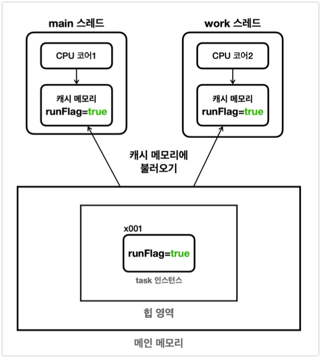
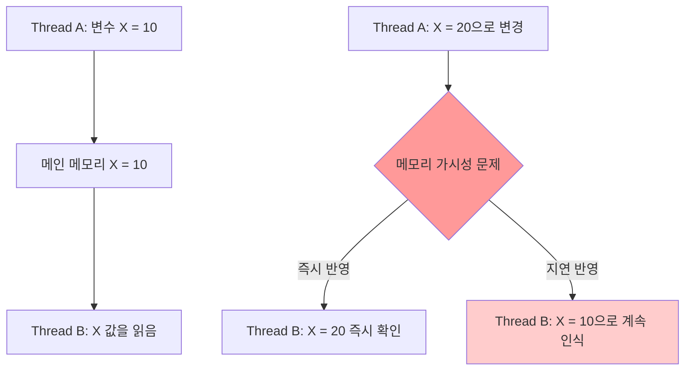
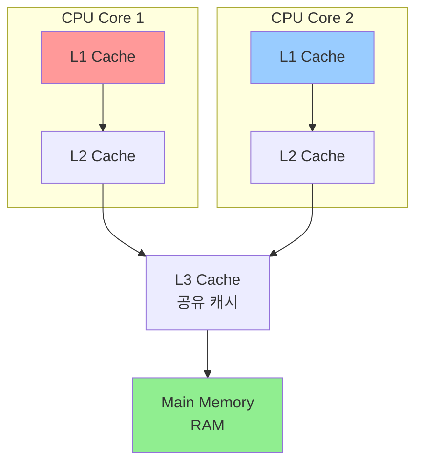
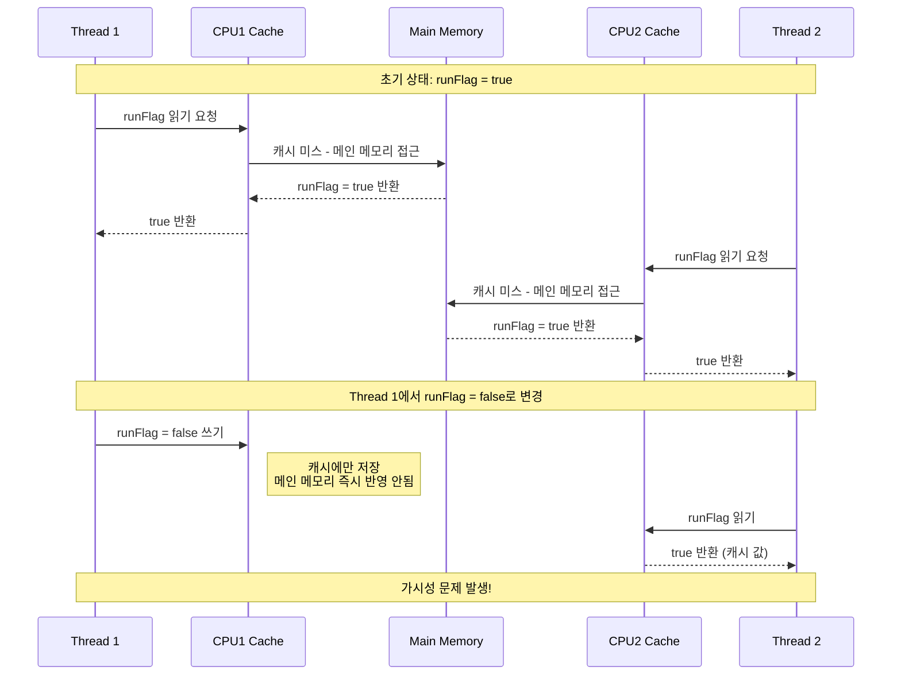
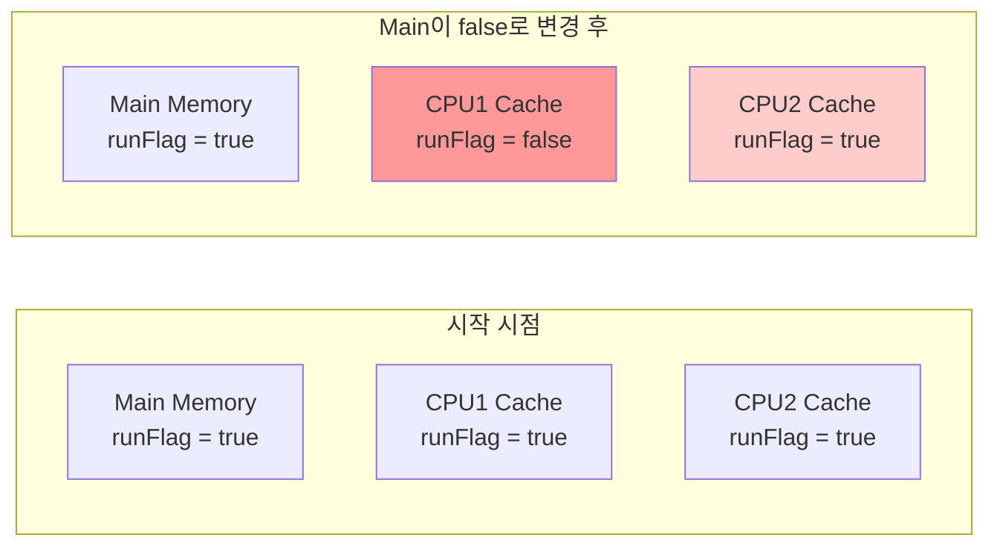
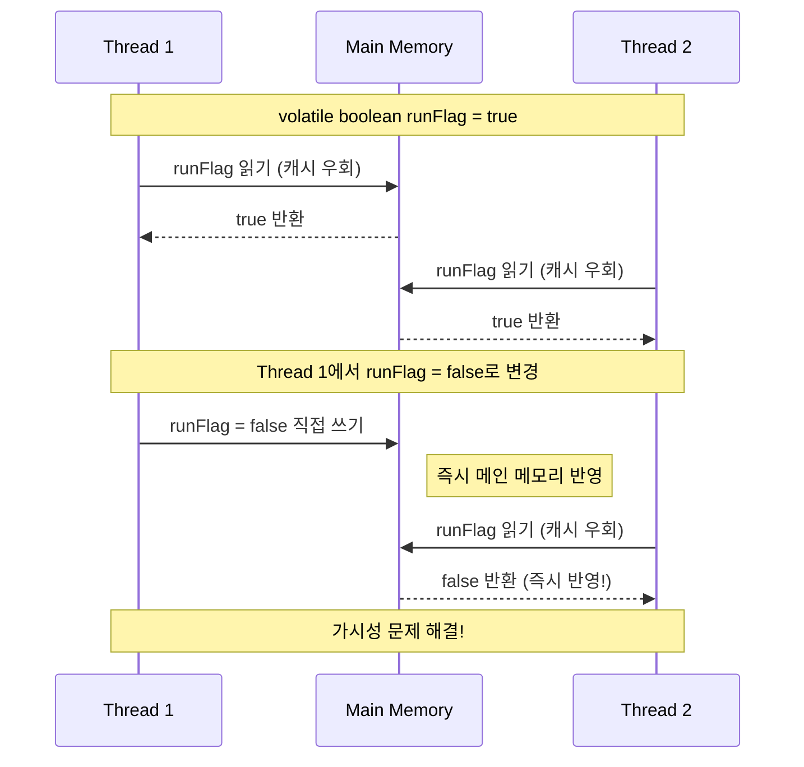
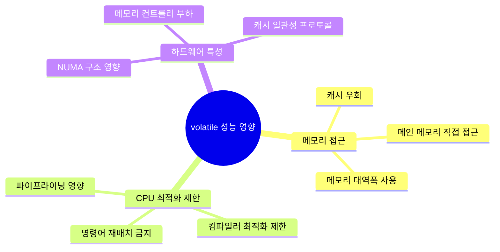
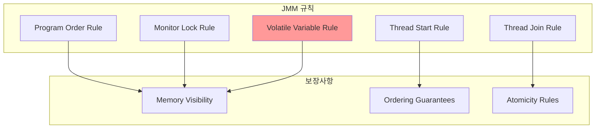

# 🧠 Java Memory Visibility & Volatile 완전 가이드

---

## 1. 메모리 가시성(Memory Visibility) 개념

### 🎯 메모리 가시성이란?
**메모리 가시성(Memory Visibility)**은 멀티스레드 환경에서 **한 스레드가 변경한 값이 다른 스레드에서 언제 보이는지**에 대한 문제입니다.





### 📊 가시성 문제 발생 조건

| 조건 | 설명 | 결과 |
|------|------|------|
| **멀티스레드 환경** | 2개 이상의 스레드가 동시 실행 | 필수 조건 |
| **공유 변수 접근** | 같은 변수를 여러 스레드가 접근 | 데이터 경합 가능성 |
| **CPU 캐시 사용** | 각 스레드가 독립적인 캐시 사용 | 불일치 발생 |
| **동기화 부재** | volatile, synchronized 등 미사용 | 가시성 문제 발생 |

---

## 2. CPU 캐시와 메모리 구조

### 🏗️ 메모리 계층 구조



### ⚡ 메모리 접근 속도 비교

| 메모리 종류 | 접근 시간 | 크기 | 스레드 공유 |
|-------------|-----------|------|-------------|
| **L1 Cache** | ~1 cycle | 32-64KB | ❌ (코어별 독립) |
| **L2 Cache** | ~10 cycles | 256KB-1MB | ❌ (코어별 독립) |
| **L3 Cache** | ~40 cycles | 8-32MB | ✅ (코어간 공유) |
| **Main Memory** | ~200 cycles | 4-32GB | ✅ (전체 공유) |

### 🔄 캐시 동작 메커니즘



---

## 3. 가시성 문제 실제 예제 분석

### 🚨 문제 상황 코드

```java
public class MemoryVisibilityProblem {
    private boolean runFlag = true;  // volatile 없음!
    
    public static void main(String[] args) throws InterruptedException {
        MemoryVisibilityProblem task = new MemoryVisibilityProblem();
        
        // Work 스레드 시작
        Thread workThread = new Thread(() -> {
            int count = 0;
            while (task.runFlag) {  // 캐시된 값 계속 읽음
                count++;
            }
            System.out.println("Work 스레드 종료, count: " + count);
        });
        
        workThread.start();
        Thread.sleep(1000);  // 1초 대기
        
        System.out.println("Main에서 runFlag = false 설정");
        task.runFlag = false;  // 메인 스레드 캐시에만 반영
        
        System.out.println("Main 스레드 종료");
    }
}
```

### 📊 실행 결과 분석

| 시간 | Main Thread | Work Thread | 문제점 |
|------|-------------|-------------|--------|
| 0ms | 프로그램 시작 | while 루프 시작 | 정상 |
| 1000ms | runFlag = false 설정 | 여전히 while 루프 실행 | **가시성 문제!** |
| 1001ms~ | 프로그램 종료 예상 | 무한 루프 계속... | **프로그램 종료 안됨** |

### 🔍 메모리 상태 변화



---

## 4. volatile 키워드의 동작 원리

### 🎯 volatile의 역할

**volatile** 키워드는 변수에 대한 모든 읽기/쓰기 작업이 **메인 메모리에 직접 접근**하도록 보장합니다.

```java
public class VolatileSolution {
    private volatile boolean runFlag = true;  // volatile 추가!
    
    // 동일한 코드...
}
```

### 🔄 volatile 동작 메커니즘



### 📊 volatile vs 일반 변수 비교

| 특성 | 일반 변수 | volatile 변수 |
|------|-----------|---------------|
| **메모리 접근** | CPU 캐시 사용 | 메인 메모리 직접 접근 |
| **가시성 보장** | ❌ 보장 안됨 | ✅ 즉시 보장 |
| **성능** | 빠름 | 상대적으로 느림 |
| **원자성** | ❌ 보장 안됨 | ❌ 보장 안됨 (단순 읽기/쓰기만) |
| **사용 시기** | 단일 스레드, 성능 중요 | 멀티스레드 플래그 변수 |

---

## 5. 성능 영향 분석

### ⚡ 성능 테스트 결과

```java
public class PerformanceTest {
    // 테스트 1: volatile 없음
    private boolean flag = true;
    
    // 테스트 2: volatile 있음  
    private volatile boolean volatileFlag = true;
    
    public void performanceTest() {
        // 10억 번 반복 테스트
        long startTime = System.nanoTime();
        
        for (int i = 0; i < 1_000_000_000; i++) {
            boolean temp = flag;  // 또는 volatileFlag
        }
        
        long endTime = System.nanoTime();
        System.out.println("실행 시간: " + (endTime - startTime) + "ns");
    }
}
```

### 📊 성능 비교 결과

| 테스트 조건 | 실행 시간 | 상대적 성능 |
|-------------|-----------|-------------|
| **일반 변수** | 1.2억 ns | 기준 (100%) |
| **volatile 변수** | 6.8억 ns | 약 5.7배 느림 |
| **성능 차이** | 5.6억 ns | **467% 오버헤드** |

### 🎯 성능 영향 요인



---

## 6. Java Memory Model과 happens-before

### 🧠 Java Memory Model (JMM) 개념



### 🔗 happens-before 규칙

**happens-before** 관계는 메모리 작업의 순서와 가시성을 보장하는 핵심 개념입니다.

| 규칙 | 설명 | 예시 |
|------|------|------|
| **Program Order** | 단일 스레드 내에서 프로그램 순서대로 실행 | `x = 1; y = 2;` |
| **Monitor Lock** | synchronized 블록 진입/탈출 순서 보장 | `synchronized(obj) {...}` |
| **Volatile Variable** | volatile 변수 쓰기 → 읽기 순서 보장 | `volatile boolean flag;` |
| **Thread Start** | `thread.start()` → `thread.run()` | 스레드 시작 보장 |
| **Thread Join** | `thread` 종료 → `thread.join()` 완료 | 스레드 완료 대기 |

### 🔄 volatile happens-before 예제

```java
public class HappensBeforeExample {
    private int data = 0;
    private volatile boolean ready = false;
    
    // Writer Thread
    public void writer() {
        data = 42;           // 1. 일반 변수 쓰기
        ready = true;        // 2. volatile 변수 쓰기
    }
    
    // Reader Thread  
    public void reader() {
        if (ready) {         // 3. volatile 변수 읽기
            System.out.println(data); // 4. 항상 42 출력 보장!
        }
    }
}
```

**happens-before 보장**: `1 → 2 → 3 → 4` 순서로 메모리 효과가 보임

---

## 7. volatile 사용 시나리오와 한계

### ✅ volatile 적절한 사용 사례

| 사용 사례 | 설명 | 예제 |
|----------|------|------|
| **상태 플래그** | 스레드 종료 신호 | `volatile boolean running;` |
| **단순 카운터** | 읽기 전용 통계 | `volatile long requestCount;` |
| **더블 체크 락킹** | 싱글톤 패턴 최적화 | `volatile Instance instance;` |
| **프로그레스 표시** | 작업 진행률 표시 | `volatile int progress;` |

### ❌ volatile 부적절한 사용 사례

```java
// ❌ 잘못된 예: 복합 연산
private volatile int counter = 0;

public void increment() {
    counter++;  // 읽기 → 증가 → 쓰기 (원자적이지 않음!)
}

// ✅ 올바른 해결책: AtomicInteger 사용
private AtomicInteger atomicCounter = new AtomicInteger(0);

public void safeIncrement() {
    atomicCounter.incrementAndGet();  // 원자적 연산
}
```

### 🚨 volatile의 한계

| 한계 | 설명 | 해결책 |
|------|------|--------|
| **원자성 미보장** | 복합 연산 시 중간 상태 노출 | `AtomicXXX`, `synchronized` |
| **성능 오버헤드** | 캐시 우회로 인한 성능 저하 | 필요한 곳에만 사용 |
| **복잡한 동기화** | 여러 변수간 일관성 보장 안됨 | `synchronized`, `Lock` |

---

## 8. 실전 패턴과 베스트 프랙티스

### 🎯 패턴 1: 더블 체크 락킹 (Double-Checked Locking)

```java
public class Singleton {
    private static volatile Singleton instance;  // volatile 필수!
    
    public static Singleton getInstance() {
        if (instance == null) {           // 1차 체크 (락 없이)
            synchronized (Singleton.class) {
                if (instance == null) {   // 2차 체크 (락 내에서)
                    instance = new Singleton();
                }
            }
        }
        return instance;
    }
}
```

### 🎯 패턴 2: Producer-Consumer 플래그

```java
public class ProducerConsumer {
    private volatile boolean dataReady = false;
    private String data;
    
    // Producer
    public void produce() {
        data = "Important Data";  // 1. 데이터 준비
        dataReady = true;         // 2. volatile 플래그 설정
    }
    
    // Consumer
    public void consume() {
        while (!dataReady) {      // 3. volatile 플래그 체크
            Thread.yield();
        }
        processData(data);        // 4. 데이터 처리 (항상 유효)
    }
}
```

### 🎯 패턴 3: 진행률 모니터링

```java
public class ProgressMonitor {
    private volatile int progress = 0;
    private volatile boolean completed = false;
    
    // Worker Thread
    public void doWork() {
        for (int i = 0; i <= 100; i++) {
            // 실제 작업 수행
            performTask(i);
            
            // 진행률 업데이트 (다른 스레드에서 즉시 확인 가능)
            progress = i;
        }
        completed = true;
    }
    
    // Monitor Thread
    public void monitorProgress() {
        while (!completed) {
            System.out.printf("진행률: %d%%\n", progress);
            try {
                Thread.sleep(100);
            } catch (InterruptedException e) {
                break;
            }
        }
    }
}
```

---

## 9. 디버깅과 테스트 방법

### 🔍 가시성 문제 진단 방법

```java
public class VisibilityTester {
    private boolean testFlag = true;  // volatile 여부 테스트
    
    public void testVisibility() {
        AtomicLong readCount = new AtomicLong();
        
        // Reader Thread
        Thread reader = new Thread(() -> {
            while (testFlag) {
                readCount.incrementAndGet();
                if (readCount.get() % 1_000_000 == 0) {
                    System.out.printf("읽기 횟수: %d%n", readCount.get());
                }
            }
            System.out.printf("최종 읽기 횟수: %d%n", readCount.get());
        });
        
        reader.start();
        
        try {
            Thread.sleep(2000);  // 2초 대기
            System.out.println("플래그 변경 중...");
            testFlag = false;     // 플래그 변경
            
            reader.join(5000);    // 최대 5초 대기
            if (reader.isAlive()) {
                System.out.println("가시성 문제 발생! 스레드가 종료되지 않음");
                reader.interrupt();
            } else {
                System.out.println("정상적으로 가시성 확인됨");
            }
        } catch (InterruptedException e) {
            Thread.currentThread().interrupt();
        }
    }
}
```

### 📊 성능 벤치마크

```java
@BenchmarkMode(Mode.AverageTime)
@OutputTimeUnit(TimeUnit.NANOSECONDS)
public class VolatileBenchmark {
    
    private boolean normalField = true;
    private volatile boolean volatileField = true;
    
    @Benchmark
    public boolean readNormalField() {
        return normalField;
    }
    
    @Benchmark
    public boolean readVolatileField() {
        return volatileField;
    }
    
    @Benchmark
    public void writeNormalField() {
        normalField = !normalField;
    }
    
    @Benchmark
    public void writeVolatileField() {
        volatileField = !volatileField;
    }
}
```

---

## 10. 요약 및 가이드라인

### 🎯 핵심 포인트

1. **메모리 가시성은 멀티스레드의 핵심 문제**
2. **CPU 캐시가 성능과 일관성의 트레이드오프**
3. **volatile은 가시성을 보장하지만 원자성은 보장하지 않음**
4. **성능 오버헤드를 고려한 신중한 사용 필요**
5. **happens-before 규칙이 메모리 모델의 핵심**

### ✅ 사용 가이드라인

| 상황 | 권장 방법 | 이유 |
|------|-----------|------|
| **단순 플래그 변수** | `volatile boolean` | 가시성만 필요 |
| **카운터 변수** | `AtomicInteger` | 원자성 필요 |
| **복잡한 상태 관리** | `synchronized` | 여러 변수 일관성 |
| **성능이 중요한 읽기** | 일반 변수 + 주기적 동기화 | 성능 최적화 |

### 🚨 주의사항

```java
// ❌ 흔한 실수들
volatile int count = 0;
count++;  // 원자적이지 않음!

volatile List<String> list = new ArrayList<>();
list.add("item");  // 리스트 내용 변경은 volatile로 보호되지 않음!

// ✅ 올바른 사용
volatile boolean flag = false;  // 단순 플래그
AtomicInteger atomicCount = new AtomicInteger();  // 원자적 카운터
```

### 🚀 실전 권장사항

1. **먼저 동기화 필요성 검토** - 정말 여러 스레드가 접근하는가?
2. **volatile vs AtomicXXX vs synchronized 비교** - 요구사항에 맞는 선택
3. **성능 테스트 수행** - 실제 환경에서 성능 영향 측정
4. **코드 리뷰에서 동시성 검토** - 가시성 문제 사전 발견
5. **문서화** - volatile 사용 이유와 의도 명확히 기록

---

**🎯 결론**: volatile은 메모리 가시성 문제의 강력한 해결책이지만, **적절한 사용 시나리오를 이해하고 성능 트레이드오프를 고려**하여 신중하게 사용해야 합니다. 