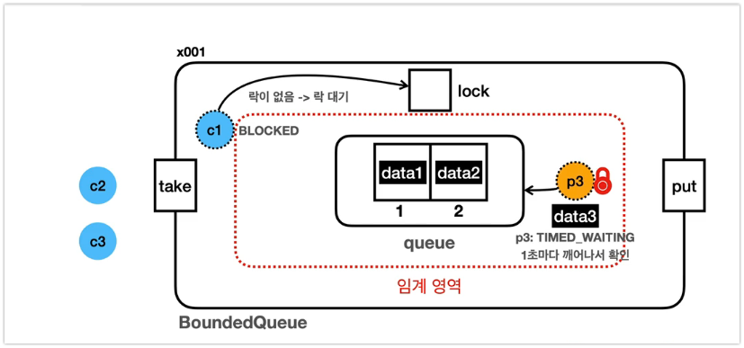
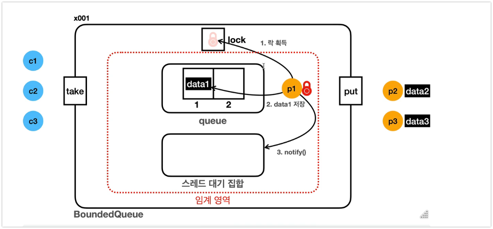
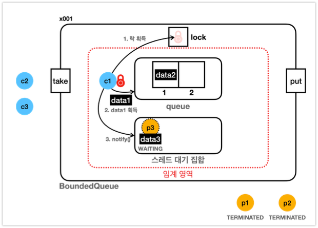
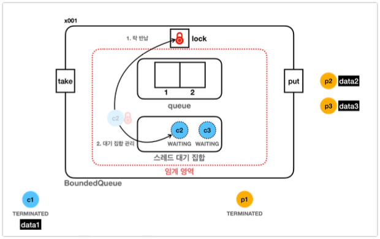
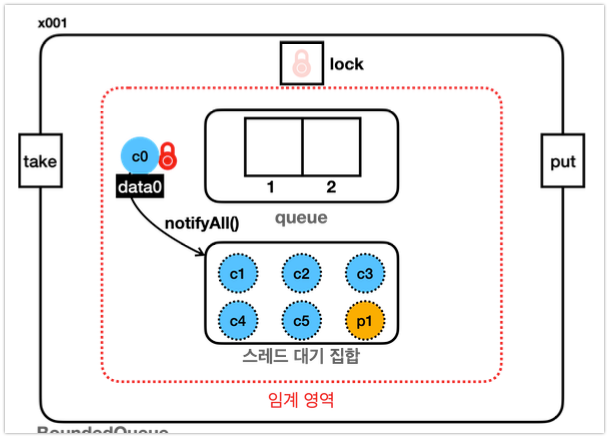
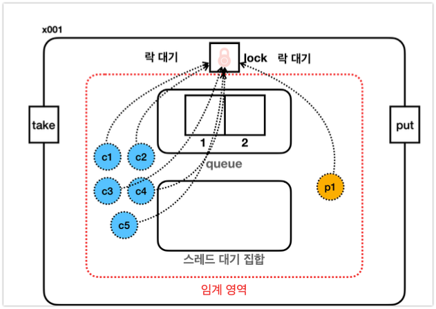

# Wait-Notify 메커니즘 완전 정리

## 개요
- synchronized 의 임계영역 안에서 발생하는 무한 대기 문제를 wait()와 notify() 메서드를 통해 해결하는 자바의 핵심 동기화 메커니즘

> Wait-notify 메커니즘은 synchronized의 락 경합 문제를 해결하는 핵심 도구입니다. 락을 해제하고 조건부 대기함으로써 스레드들이 협력적으로 작업할 수 있게 해줍니다.


## synchronized의 무한 대기 문제

### 문제 상황



```java
// 생산자-소비자 패턴에서의 문제
public class ProducerConsumer {
    private Queue<Integer> queue = new LinkedList<>();
    private final int MAX_SIZE = 2;
    
    // 잘못된 구현 - 무한 대기 발생 가능
    public synchronized void put(int value) {
        while (queue.size() == MAX_SIZE) {
            // 여기서 무한 대기 발생!
            // 락을 놓지 않은 채 대기하므로 소비자가 락을 얻을 수 없음
        }
        queue.offer(value);
        System.out.println("생산: " + value);
    }
    
    public synchronized int take() {
        while (queue.isEmpty()) {
            // 여기서도 무한 대기 발생!
            // 락을 놓지 않은 채 대기하므로 생산자가 락을 얻을 수 없음
        }
        int value = queue.poll();
        System.out.println("소비: " + value);
        return value;
    }
}
```

### 왜 무한 대기에 빠지는가?
1. **락 보유 상태로 대기**: synchronized 블록 내에서 while 루프로 조건을 확인하며 대기
2. **락 해제 없음**: 조건이 만족되지 않아도 락을 해제하지 않음
3. **데드락 상황**: 다른 스레드가 조건을 만족시킬 수 없어 영원히 대기

### 시나리오 예시
```
1. 큐가 가득참 (크기: 2/2)
2. Producer 스레드가 put() 호출 → 락 획득
3. while(queue.size() == MAX_SIZE) 조건 확인 → true
4. 무한 루프 시작 (락을 유지한 채)
5. Consumer 스레드가 take() 호출 → 락 대기
6. Producer는 락을 놓지 않아 Consumer가 큐를 비울 수 없음
7. ❌ 데드락 발생
```

## Wait-Notify 메커니즘 해결책

### 1. Object.wait() - 락 해제와 대기
```java
public synchronized void put(int value) throws InterruptedException {
    while (queue.size() == MAX_SIZE) {
        wait(); // ✅ 락을 해제하고 대기
    }
    queue.offer(value);
    notifyAll(); // 대기 중인 소비자들 깨우기
}
```

#### wait() 메서드의 동작 과정
1. **전제조건**: 현재 스레드가 해당 객체의 락(모니터락)을 보유해야 함
2. **락 해제**: 현재 스레드가 가진 락을 즉시 반납
3. **대기 상태 전환**: 스레드를 WAITING 상태로 전환
4. **대기 집합 진입**: 해당 객체의 대기 집합(wait set)에 스레드 추가
5. **알림 대기**: notify() 또는 notifyAll() 호출까지 대기
6. **락 재획득**: 깨어나면 락을 다시 획득한 후 wait() 이후 코드 실행

#### wait() 사용 시 주의사항
- **반드시 synchronized 블록 내에서 호출**
- **while 루프와 함께 사용** (spurious wakeup 방지)
- **InterruptedException 처리 필요**

### 2. notify() vs notifyAll() - 대기 스레드 깨우기


#### notify() - 단일 스레드 깨우기
```java
publ우ic synchronized int take() throws InterruptedException {
    while (queue.isEmpty()) {
        wait();
    }
    int value = queue.poll();
    notify(); // 대기 중인 스레드 하나만 깨움
    return value;
}
```

#### notifyAll() - 모든 대기 스레드 깨우기
```java
public synchronized int take() throws InterruptedException {
    while (queue.isEmpty()) {
        wait();
    }
    int value = queue.poll();
    notifyAll(); // 대기 중인 모든 스레드 깨움 (권장)
    return value;
}
```

## notify() 실행 시 WAITING -> BLOCKED 상태 변경하는 이유

### 왜 WAITING에서 바로 RUNNABLE로 가지 않을까?

notify() 호출 시 대기 중인 스레드가 **WAITING → RUNNABLE**로 바로 가지 않고 **WAITING → BLOCKED**를 거치는 이유:

#### 스레드 상태 전환 시각화

```
📊 WAITING → BLOCKED → RUNNABLE 과정

┌─────────────────────────────────────────────────────────────┐
│                  스레드 상태 변화 다이어그램                    │
└─────────────────────────────────────────────────────────────┘

  ThreadA (락 보유)    ThreadB (wait 상태)
  ┌────────────┐      ┌────────────┐
  │ RUNNABLE   │      │  WAITING   │
  │    🔒      │      │     💤     │
  └────────────┘      └────────────┘
        │                    │
        │                    │
   notify() 호출               │
        │                    │
        ▼                    ▼
  ┌────────────┐      ┌────────────┐
  │ RUNNABLE   │      │  BLOCKED   │  ← 여기가 핵심!
  │    🔒      │      │   🚫🔒     │  (락 대기 중)
  └────────────┘      └────────────┘
        │                    │
        │                    │
  synchronized 블록 종료       │
        │                    │
        ▼                    ▼
  ┌────────────┐      ┌────────────┐
  │  WAITING   │      │ RUNNABLE   │
  │            │      │    🔒      │
  └────────────┘      └────────────┘
```

#### 시간순 상태 변화 ASCII 플로우

```
🕐 T=0: 초기 상태
┌──────────────┬─────────────────────┬─────────────────────┐
│    시간      │      ThreadA        │      ThreadB        │
├──────────────┼─────────────────────┼─────────────────────┤
│ T=0          │ 🔒 RUNNABLE        │ 💤 WAITING          │
│              │ (락 보유 중)        │ (wait() 상태)       │
└──────────────┴─────────────────────┴─────────────────────┘

🕑 T=1: notify() 호출
┌──────────────┬─────────────────────┬─────────────────────┐
│ T=1          │ 🔒 RUNNABLE        │ 🚫 BLOCKED          │
│              │ notify() 호출!      │ 락 대기 중!         │
│              │ 하지만 여전히 락 보유 │                     │
└──────────────┴─────────────────────┴─────────────────────┘

🕒 T=2: 추가 작업 수행
┌──────────────┬─────────────────────┬─────────────────────┐
│ T=2          │ 🔒 RUNNABLE        │ 🚫 BLOCKED          │
│              │ doMoreWork() 실행   │ 여전히 락 대기...    │
└──────────────┴─────────────────────┴─────────────────────┘

🕓 T=3: 락 해제
┌──────────────┬─────────────────────┬─────────────────────┐
│ T=3          │    WAITING          │ 🔒 RUNNABLE        │
│              │ 락 해제!            │ 락 획득 성공!       │
│              │                     │ wait() 이후 실행    │
└──────────────┴─────────────────────┴─────────────────────┘
```

#### 만약 WAITING → RUNNABLE 직접 전환이라면?

```
❌ 잘못된 시나리오 (직접 전환)

 notify() 호출
      ↓
┌─────────────┐     즉시     ┌─────────────┐
│   WAITING   │ ────────→   │  RUNNABLE   │
└─────────────┘             └─────────────┘
                                   ↓
                            락 획득 시도 실패
                                   ↓
                          다시 대기 상태로...
                                   ↓
                            🔄 비효율적 순환!
```

```
✅ 올바른 시나리오 (BLOCKED 경유)

 notify() 호출
      ↓
┌─────────────┐   일시적   ┌─────────────┐   락 해제시   ┌─────────────┐
│   WAITING   │ ────────→ │   BLOCKED   │ ────────────→ │  RUNNABLE   │
└─────────────┘   대기     └─────────────┘   즉시 전환    └─────────────┘
                           (락 대기 중)                   (실행 준비)
```

#### BLOCKED 상태의 중요성

```
🏭 스레드 공장 비유

           대기실 (WAITING)          접수실 (BLOCKED)          작업실 (RUNNABLE)
         ┌─────────────────┐       ┌─────────────────┐       ┌─────────────────┐
         │   😴 Thread1   │       │  🚫 Thread2    │       │  🔧 Thread3    │
         │   😴 Thread2   │  ───→ │     (락 대기)   │  ───→ │     (작업 중)   │
         │   😴 Thread3   │       │                 │       │                 │
         └─────────────────┘       └─────────────────┘       └─────────────────┘
              ↑                            ↑                          ↑
         wait() 호출                  notify() 호출               락 획득 성공
```

#### 락 소유권 문제 시각화

```java
public synchronized void methodA() {
    // ┌─ 이 지점에서 ThreadA가 락 보유 🔒
    // │
    someCondition = true;      // ← ThreadA 계속 실행
    notify();                  // ← ThreadB를 깨우지만...
    //                         //   ThreadA가 여전히 락 보유!
    doSomeMoreWork();          // ← 추가 작업 (시간 소요)
    expensiveOperation();      // ← 오래 걸리는 작업
    // │
    // └─ 여기서야 락 해제 🔓
}

/* 
   ThreadB 상태:
   notify() → BLOCKED (락을 기다림)
            ⏳⏳⏳ 대기...
   락 해제 → RUNNABLE (드디어 실행!)
*/
```

#### 상태 전환의 3단계

```
🎯 핵심 포인트: 왜 3단계인가?

1단계: WAITING (조건 대기)
┌─────────────────────────────────────┐
│ "조건이 맞지 않아서 기다리는 중"      │
│ 💭 "큐가 비어있네... 대기하자"        │
└─────────────────────────────────────┘
                 ↓ notify()
                 
2단계: BLOCKED (락 대기)  
┌─────────────────────────────────────┐
│ "조건은 맞을 수 있지만 락이 없어!"    │
│ 🚫 "누군가 락을 쓰고 있네..."         │
└─────────────────────────────────────┘
                 ↓ 락 해제
                 
3단계: RUNNABLE (실행 준비)
┌─────────────────────────────────────┐
│ "조건도 맞고 락도 있다! 실행하자!"    │
│ 🚀 "드디어 wait() 이후 코드 실행!"    │
└─────────────────────────────────────┘
```

notify()로 깨어난 스레드는 반드시 **락을 재획득한 후에야** 실제 실행 가능한 상태가 됩니다. 

## notify 한계 및 notifyAll() 사용

### notify() 한계

- notify()는 대기 집합에서 임의의 스레드 하나만 깨운다 (WAITING → BLOCKED)
- 잘못된 스레드가 깨어날 수 있어 비효율적인 상황 발생

#### 문제 시나리오: 소비자만 대기 중인 상황
대기 집합에 c1, c2, c3 소비자 스레드들이 대기 중이고 큐가 비어있다고 가정:

```java
// 큐: [] (비어있음), 대기집합: [c1, c2, c3]
c1 -> 데이터 소비 완료 -> notify() 호출 -> c2 스레드를 깨움
c2 -> BLOCKED 상태가 됨 -> c1이 락 반납 -> c2가 락 획득
c2 -> 큐 확인 -> 여전히 비어있음 -> wait() 다시 호출 -> 대기집합 복귀

// 결과: c2는 불필요하게 깨어났다가 다시 대기 상태로
//      실제로는 생산자를 깨워야 하는데 같은 종류의 소비자만 깨움
```

#### 더 심각한 문제: 생산자-소비자 혼재 상황
```java
// 큐: [A, B] (가득참)
// 대기집합: [producer1, consumer1, producer2]

consumer1 -> 데이터 A 소비 -> notify() 호출 -> producer2 깨움 (운좋음)
// 또는
consumer1 -> 데이터 A 소비 -> notify() 호출 -> producer1 깨움 (문제없음)  
// 하지만
consumer1 -> 데이터 A 소비 -> notify() 호출 -> consumer1 깨움 (비효율!)
```

### notifyAll() 



notify()의 한계를 해결하기 위해 **notifyAll()** 사용을 권장:

#### 스레드 기아(Starvation) 문제
```java
// 큐: [] (비어있음)
// 대기집합: [c1, c2, c3, c4, c5, p1] (소비자 5개, 생산자 1개)

c1 데이터 소비 완료 -> notify() 호출 -> c2 깨움 (운나쁨)
c2 -> 큐 비어있음 -> 다시 wait() -> 의미없는 작업

c1 데이터 소비 완료 -> notify() 호출 -> c3 깨움 (또 운나쁨)  
c3 -> 큐 비어있음 -> 다시 wait() -> 의미없는 작업

// p1 생산자는 계속 깨어나지 못해 기아 상태 발생!
```

notify()는 스레드 선택이 무작위이므로:
- **잘못된 타입의 스레드**가 계속 깨어날 수 있음
- **필요한 스레드**(생산자)가 기아 상태에 빠질 수 있음
- **무의미한 컨텍스트 스위칭** 발생

#### notifyAll()로 해결
```java
public synchronized T take() throws InterruptedException {
    while (queue.isEmpty()) {
        wait();
    }
    T item = queue.poll();
    notifyAll(); // 모든 대기 스레드를 깨워서 조건 재확인하게 함
    return item;
}

public synchronized void put(T item) throws InterruptedException {
    while (queue.size() == capacity) {
        wait();
    }
    queue.offer(item);
    notifyAll(); // 모든 대기 스레드를 깨움
}
```

#### notifyAll() 동작 과정
```java
// 큐: [] (비어있음), 대기집합: [c1, c2, c3, p1]

p1 -> 데이터 생산 -> notifyAll() 호출
-> 모든 대기 스레드 깨어남: c1, c2, c3 모두 BLOCKED 상태로 전환
-> p1이 락 반납
-> c1이 락 획득 -> 조건 확인 -> 데이터 있음 -> 소비 후 계속 실행
-> c2가 락 획득 -> 조건 확인 -> 데이터 없음 -> wait() 복귀
-> c3가 락 획득 -> 조건 확인 -> 데이터 없음 -> wait() 복귀
```

#### notifyAll()의 장점과 단점

**장점:**
- **안전성**: 모든 대기 스레드가 조건을 다시 확인할 기회를 얻음
- **정확성**: 조건을 만족하는 스레드가 확실히 깨어남  
- **기아 방지**: 특정 스레드가 영원히 대기하는 상황 방지
- **단순성**: 복잡한 스레드 선택 로직 불필요

**단점:**
- **성능 오버헤드**: 불필요한 스레드들도 함께 깨어남
- **컨텍스트 스위칭 비용**: 더 많은 스레드 전환 발생

#### 권장사항
실무에서는 **정확성 > 성능**이므로 **notifyAll() 사용을 강력 권장**:
- notify()는 매우 제한적인 상황에서만 안전
- 복잡한 조건이나 여러 타입의 스레드가 있을 때는 반드시 notifyAll() 사용


## 완전한 구현 예제

### 생산자-소비자 패턴 완성본
```java
public class BoundedQueue<T> {
    private final Queue<T> queue = new LinkedList<>();
    private final int capacity;
    
    public BoundedQueue(int capacity) {
        this.capacity = capacity;
    }
    
    // 생산자 메서드
    public synchronized void put(T item) throws InterruptedException {
        while (queue.size() == capacity) {
            System.out.println(Thread.currentThread().getName() + " 대기중 (큐 가득참)");
            wait(); // 락 해제하고 대기
        }
        queue.offer(item);
        System.out.println(Thread.currentThread().getName() + " 생산: " + item);
        notifyAll(); // 대기중인 소비자들 깨우기
    }
    
    // 소비자 메서드
    public synchronized T take() throws InterruptedException {
        while (queue.isEmpty()) {
            System.out.println(Thread.currentThread().getName() + " 대기중 (큐 비어있음)");
            wait(); // 락 해제하고 대기
        }
        T item = queue.poll();
        System.out.println(Thread.currentThread().getName() + " 소비: " + item);
        notifyAll(); // 대기중인 생산자들 깨우기
        return item;
    }
    
    public synchronized int size() {
        return queue.size();
    }
}
```

### 실행 흐름 시각화

#### 해결 상황 (wait-notify 사용)
```
1. ✅ 해결 상황
   Queue: [A, B] (가득참)
   Producer 스레드 → put() 호출 → 락 획득 → while(full) → wait() 
   → 락 해제 → 대기집합(wait set) 진입
   
   Consumer 스레드 → take() 호출 → 락 획득 → 아이템 소비 → notifyAll()
   → Producer 깨우기 → 락 해제
   
   Producer 스레드 → 깨어남 → 락 재획득 → while 조건 재확인 → 아이템 생산
```

## 핵심 개념 정리

### 1. 모니터락(Monitor Lock)과 대기 집합(Wait Set)
- **모든 자바 객체는 내장 락(intrinsic lock)과 대기 집합을 가짐**
- **모니터락**: synchronized 블록/메서드 진입 시 획득하는 락
- **대기 집합**: wait() 호출 시 스레드가 대기하는 집합
- 임계영역 안에서 wait()을 호출하면 대기 상태의 스레드는 대기집합(wait set)에 들어간다.
- 모든 객체는 락(모니터락) + 대기 집합을 가지고 있다. 둘은 한쌍으로 사용된다.

### 2. Wait-Notify 생명주기
```
1. synchronized 진입 → 락 획득
2. 조건 불만족 → wait() 호출
3. 락 해제 → WAITING 상태 → 대기집합 진입
4. 다른 스레드가 notify/notifyAll 호출
5. 대기집합에서 깨어남 → BLOCKED 상태
6. 락 재획득 성공 → RUNNABLE 상태
7. wait() 이후 코드 계속 실행
```
